# 5 差分方程与数值方法

### 5.1 差分方程相比微分方程

相当于是**离散**与**连续**的关系

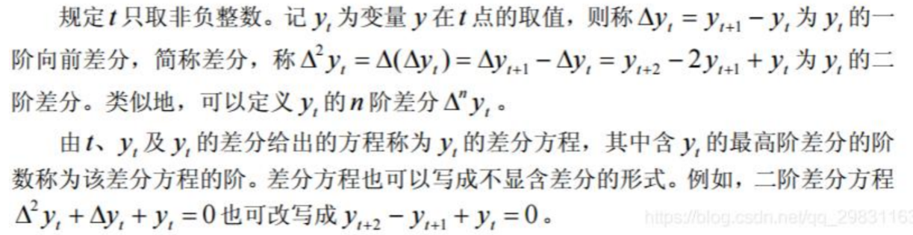

微分方程：

- 思想简单，条件纯粹，微元分析，建模容易。能够考虑到多变量构成的系统。但模型较为原始，求解并不容易。 

差分方程：

- 是对连续系统的离散化处理，能够考虑更多因素。有时求解也并不容易，但整体比微分方程应用更为宽泛。

### 5.2 人口模型的新讨论

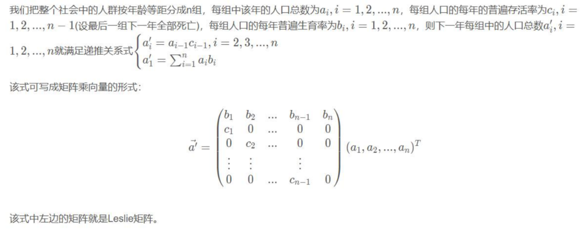

- Malthus和Logistic模型都是连续的模型 

- Leslie矩阵只能离散式做迭代 

- Malthus模型和Logistic模型考虑的因素没有Leslie模型更多，但Leslie模型操作也比较简单

### 5.3 数值计算方法

> 还好学校里讲了计算方法，不然根本听不懂这老师在讲啥

#### 5.3.1 梯度下降

<u>寻找极值</u>：沿着**梯度方向**一步一步走

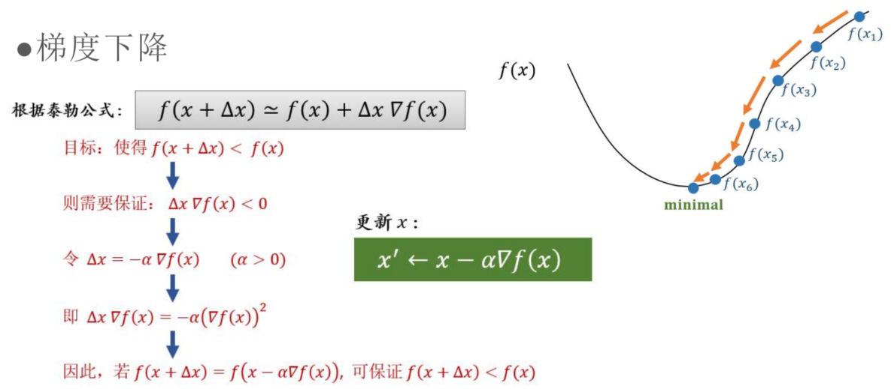

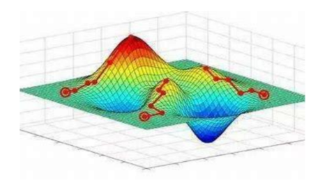

<u>梯度下降法如何**计算梯度**？</u>

> 求解梯度的三种不同形式

- **批量**梯度下降法：

  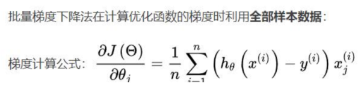

- **随机**梯度下降法：

  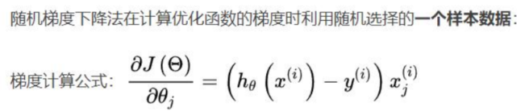

  > 在神经网络中使用较多

- **小批量**梯度下降法：

  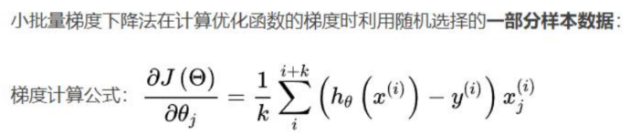

#### 5.3.2 牛顿法

<u>寻找极值</u>：迭代找到导数为0的点

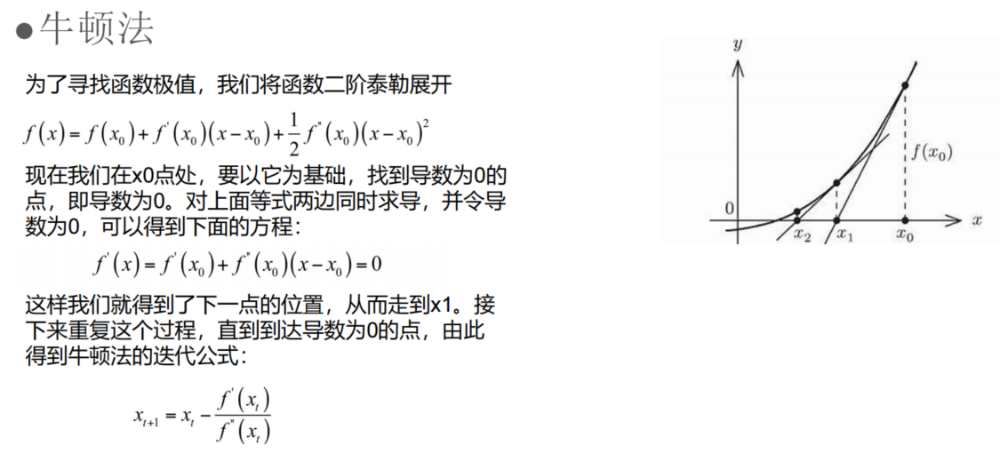

<u>牛顿法计算过程</u>：

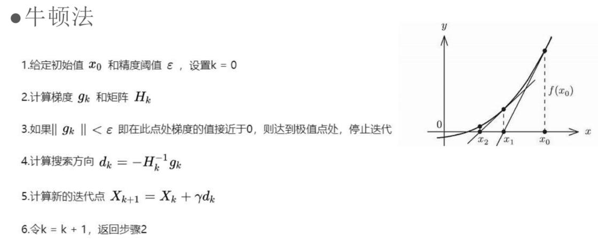

> $H_k$指的是矩阵：
> $$
> \begin{pmatrix}
> \frac{\partial^2 f}{\partial x^2}~~~\frac{\partial^2 f}{\partial x\partial y}\\
> \frac{\partial^2 f}{\partial x\partial y}~~~\frac{\partial^2 f}{\partial y^2}
> \end{pmatrix}
> $$
> 一元函数求一阶导$\rarr$二元函数梯度
>
> 一元函数求二阶导$\rarr$二元函数Hessian矩阵

#### 5.3.3 欧拉法

> 差商代替导数

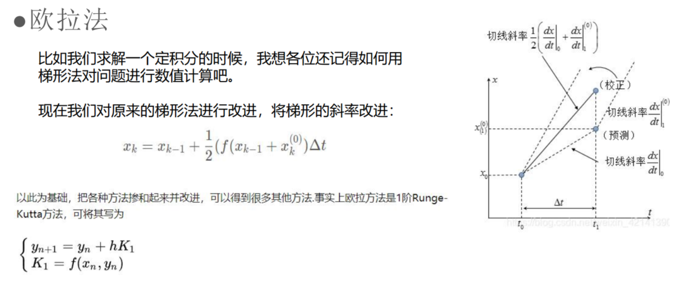

#### 5.3.4 Runge-Kutta法

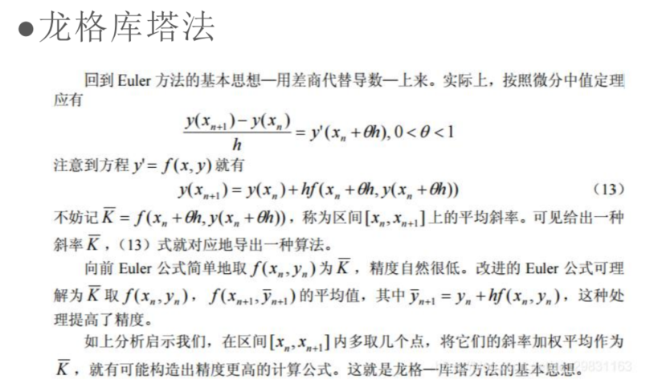

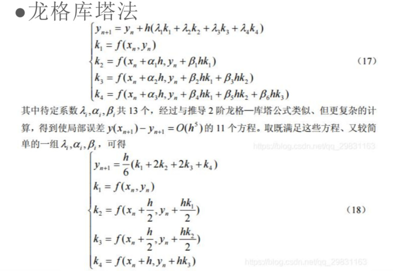

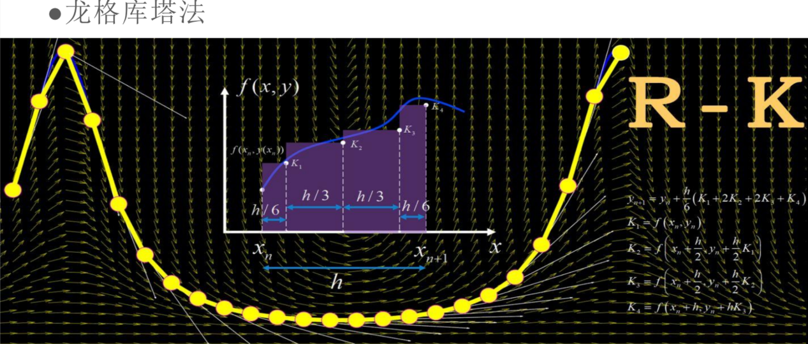

### 5.4 Python提供的数值计算方法

常见方法例如二分法、牛顿法、拟牛顿法、梯度下降、带动量梯度下降、龙格库塔、欧拉法、改进欧拉、梯形法都有集成。 

使用时参考函数的文档即可，这里也可以手动编写改进欧拉法、龙格库塔等程序，其实并没有那么可怕。（？？？）