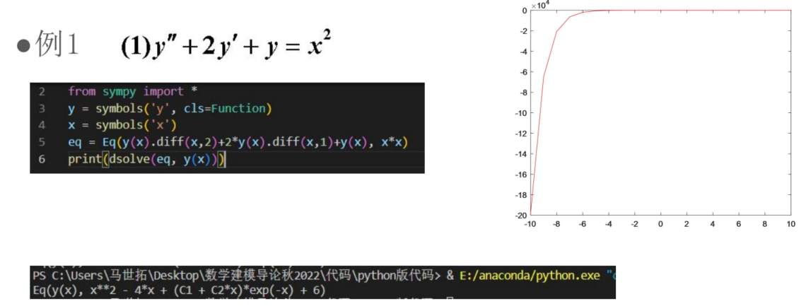
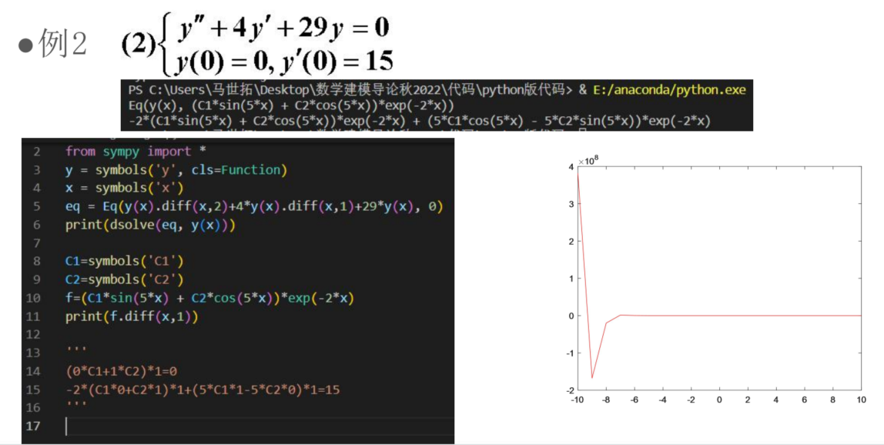
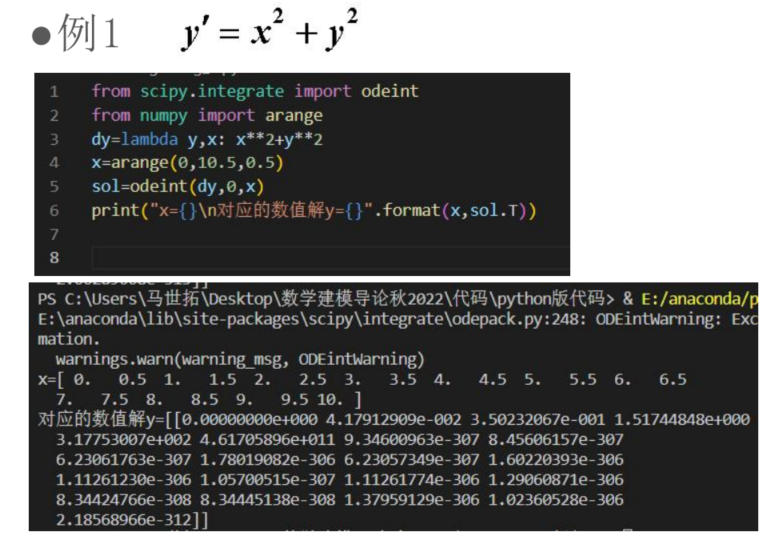
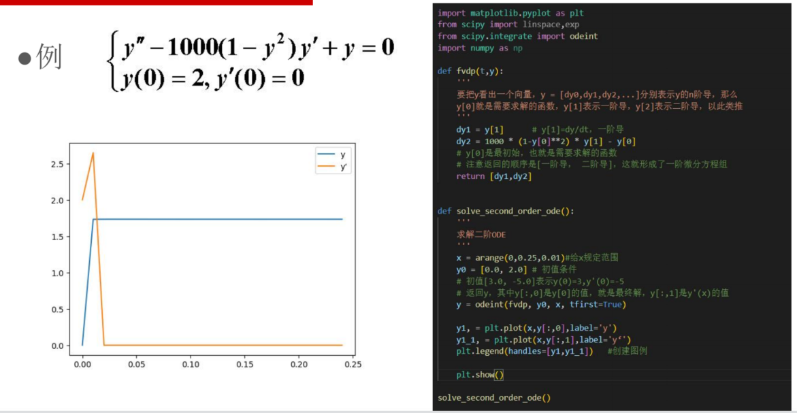

# 2 常微分方程的python求解

### 2.1 概述

符号解与数值解：

- 为什么要提到符号解和数值解呢？解不就是解吗？方程的解难道不是就一个解就够了吗？ 

- 实际上，符号解就是以代数符号与运算的形式完整地写出解的代数式，强调**解的代数性** 

- 而数值解则是在给定方程的一些初始条件下我不按式子来，而是**算出一个数值**，这个数值可以不需要完完本本的精确，满足一定的要求就可以了。 

  > 举一个最简单的例子，如果我的方程得到的解与圆周率有关（暂且假设这个解是圆的周长吧）那么解析解也就是符号解必须表示为$x=0.32\pi$，但如果只是为了求一个数值解，那么可以在圆周率取3.14的精度限制下认为x=1.0048

大多数微分方程没有符号解/解析解：

- 我们此前介绍的一阶、二阶常系数线性微分方程通解的形式就是一种符号解 
- 但在科学与工程实际中我们遇到的微分方程形式会比这些基本形式更为复杂，条件也更多 
- 事实上多数情况下，大多数微分方程其实是求不出符号解的，只能在不同取值条件下求一个数值解 
- 那么如何编写算法去求数值解才能使精度尽可能提高呢？ 
- 数值解会随着初始条件而变化，怎么变化呢？函数值又与自变量之间怎么变化呢？ 
- 这就涉及到微分方程数值解的**演化问题**和**灵敏性分析**问题

Sympy简介：

- Sympy是一个数学符号运算库。能解决积分、微分方程等各种数学运算方法，用起来也是很简单，可以和Matlab媲美。

- Sympy.dsolve方法是解微分方程符号解的一种良好方式，而对于有初始值的微分方程问题，我 

  们通常在求出其通解形式后通过解方程组的方法得到参数，通过声明符号变量的方式求得最优解。

### 2.2 python求符号解代码

sympy中相关api：

- `symbols`
- `Eq`
- `diff`
- `dsolve`
- `solve`

例一：sympy求符号解



```python
from sympy import *

y = symbols('y', cls=Function)
x = symbols('x')
eq = Eq(y(x).diff(x, 2) + 2 * y(x).diff(x, 1) + y(x), x ** 2)
print(dsolve(eq, y(x)))

```

例二：sympy求数值解

- 先求符号解
- 再代入初值



```python
from sympy import *

y = symbols('y', cls=Function)
x = symbols('x')
eq = Eq(y(x).diff(x, 2) + 4 * y(x).diff(x, 1) + 29 * y(x), 0)
print(dsolve(eq, y(x)))
# 看到上面print的结果之后才能写出下面的代码
C1, C2 = symbols('C1 C2')
f = (C1*sin(5*x) + C2*cos(5*x))*exp(-2*x)
eqs = [
    f.subs(x, 0),
    f.diff(x).subs(x, 0) - 15
]
solve(eqs, [C1, C2])
print(solve(eqs, [C1, C2]))

```

### 2.3 python求数值解代码

Python求解微分方程的**数值解**需要应用scipy.odeint方法 

虽然很多情况下解不出符号解，但是自变量取不同取值时是可以获得一个一一对应的列表的。 

我们还可以将数值解和符号解对比，画图看看 

本质上内部ode是用到了**欧拉法**和**龙格库塔法**

一阶：



```python
# 解 y' = x^2 + y^2
# 确定初值为 y(0) = 0
from scipy.integrate import odeint
from numpy import arange
def dy(y, x):
    return x*x + y*y
y0 = 0
xarray = arange(0, 10.5, 0.5)
odeint(dy, y0, xarray)
```

```python
# 解 y' = 1/(x^2 + 1) - 2*y^2
# 确定初值为 y(0) = 0
from scipy.integrate import odeint
from numpy import arange
import matplotlib.pyplot as plt
from jupyterthemes import jtplot
jtplot.style()
def dy(y, x):
    return 1/(x*x + 1) - 2*y*y
y0 = 0
xarray = arange(0, 10.5, 0.1)
sol = odeint(dy, y0, xarray)
# print(sol)
plt.plot(xarray, sol)
plt.show()
```

**高阶**：

高阶常微分方程，必须做**变量替换**，化为**一阶**微分方程组，再用 odeint 求数值解

> 之前在高等数学中学习过，这种换元，需要让**一阶导等于另外一个变量**，从而**二阶导就有了新的表现形式**，然后就可以求解了。
>
> 对应到scipy的求解中，需要定义==数组/向量==**表示y和y的各阶导**，如果求**二阶**的，这个向量就是`[y, y的一阶导]`（只写到一阶导是因为二阶导有新的表现形式，直接用来列等式即可），然后新定义两个变量`dy1`和`dy2`，列出等式即可

例如求解：$y''=1000(1-y^2)y'-y$



```python
from scipy.integrate import odeint
from numpy import arange
import matplotlib.pyplot as plt
from jupyterthemes import jtplot
jtplot.style()
def func(y, x):
    dy1 = y[1]
    dy2 = 1000*(1 - y[0]*y[0])*y[1] + y[0]
    return [dy1, dy2]
xarray = arange(0, 0.25, 0.01)
y0array = [0, 2]
sol = odeint(func, y0array, xarray)
print(sol)
y1, = plt.plot(xarray, sol[:, 0], label='y')
y1_1, = plt.plot(xarray, sol[:, 1], label='y')
plt.legend(handles=[y1, y1_1])
plt.show()
```

> 这里好像有问题，算了就这样吧