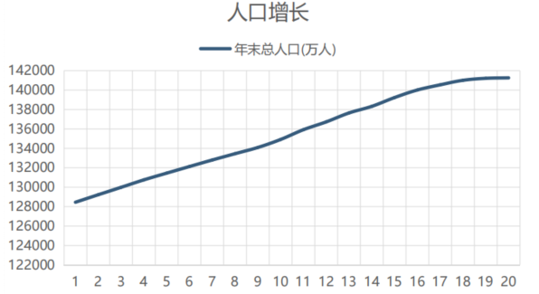
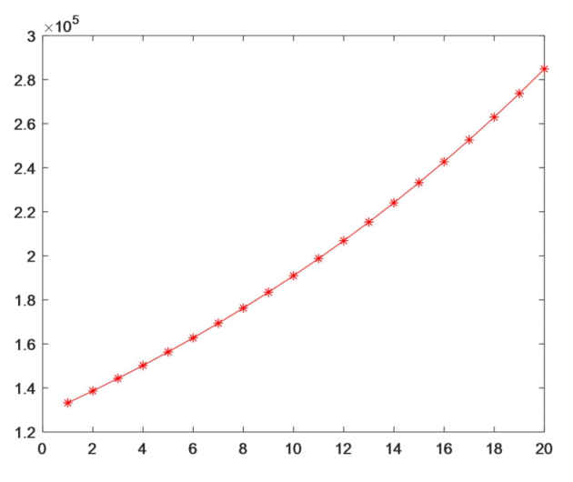
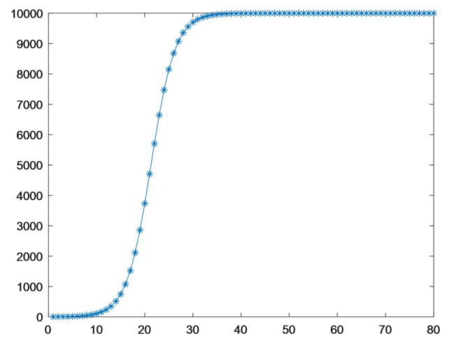
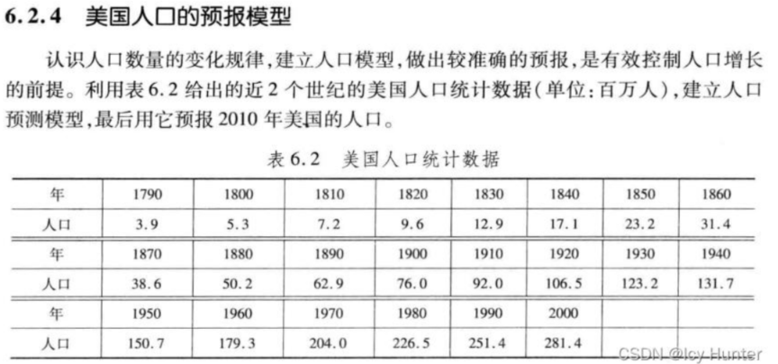
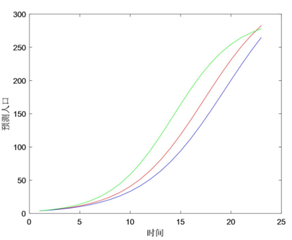
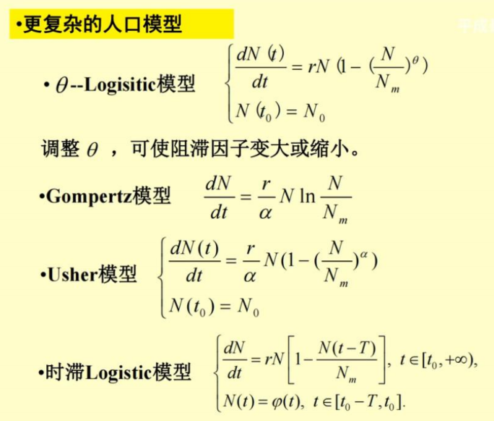

### 4.1 人口增长模型

#### 4.1.1 背景

人口问题是微分方程建模的一个典型案例。在高中生物里面我们接触过种群增长的**J型曲线和S型曲线**，现在的目的就是将这两种增长模型进行进一步**量化**。 

首先我们知道，一个种群的增长和它本身的**人口基数**有关，还与其**出生率**有关（不考虑**死亡的因素**下）。而种群的**人口基数又和出生率是有一定关系的**，是一个典型的**微分方程**案例。

人口增长主要可以用三种模型描述：

- ***Malthus Model*** 
- ***Logisitc Model*** 
- ***Leslie Model***

在模型中我们**假设**： 

- 不考虑**死亡率**对人口的影响，我们只考虑**净增长率** 
- 不考虑**人口迁移**对问题的影响，只考虑自然变化 
- 不考虑**重大突发事件**对人口的**突变**性影响 
- 不考虑**人口增长率变化的时滞性因素**

#### 4.1.2 Malthus模型

马尔萨斯模型假设**增长率**永远是个常数***r***，那么**一段时间**内增长个体有：
$$
x(t+\Delta t)-x(t)=x(t)\cdot r\Delta t
$$
按照**微分方程**的形式整理：
$$
\begin{cases}
\frac{dx}{dt}=xr\\
x(0)=x_0
\end{cases}
$$

> 能够抽象成微分方程的关键在于取“**一段时间**”这个**极小的增量**

最终解得：
$$
x(t)=x_0e^{rt}
$$

思考这个模型存在的**局限性**： 

- **种群增长率真的是一个不随时间变化的常数吗？** 
- **种群基数**越大增长真的一定越快吗？ 

Malthus模型适用的典型例子： 

- 澳洲野兔、野猫的种群增长就是一个典型的Malthus过程

#### 4.1.3 :star:Logistic模型

现在对模型进行一些修正，假设增长率会随着种群数量增加而衰减，**种群最大的平衡数量**叫***K***，那么可以得到：
$$
r=r_0(1-\frac xK)~~~~~or~~~~~r=r_0(1-\beta t)\\
\begin{cases}
\frac {dx}{dt}=xr\\
x(0)=x_0
\end{cases}
$$

> K描述的其实就是种群“卷”的程度，K越小越“卷”，越“卷”越难生存（生存压力）

解得：
$$
x(t)=\frac K{1+(\frac K{x_0}-1)e^{-rt}}
$$

Logistic模型的应用：

> 马尔萨斯和逻辑斯蒂都是宏观模型，考虑因素其实并不多，也有其他几类逻辑斯蒂模型：
>
> 
>
> > 时滞性就是说生存压力K并不是立刻起作用，而是在种群繁衍几代后才有用