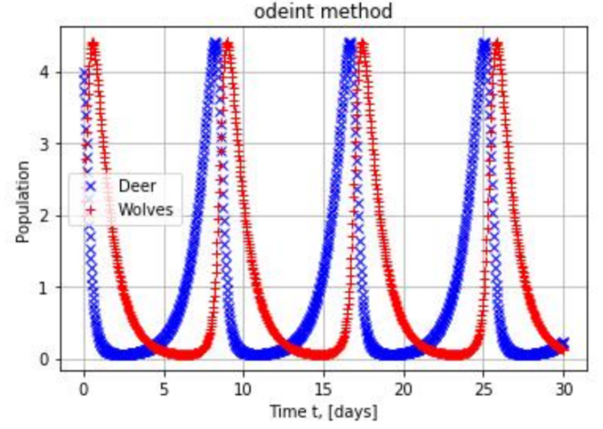
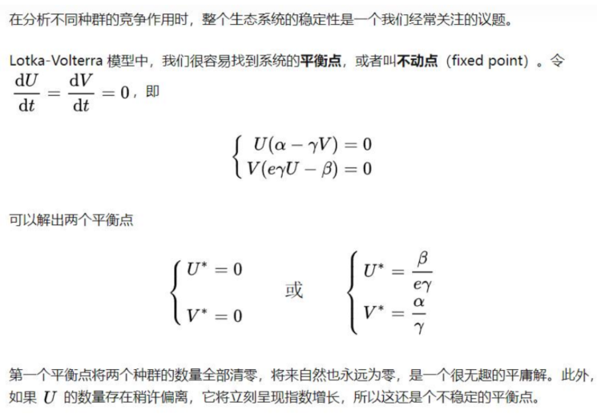
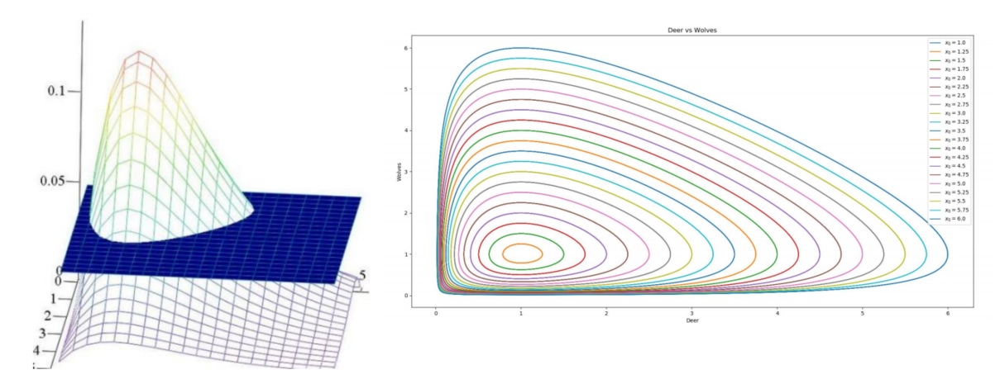

### 4.4 捕食者模型

考虑这样一个捕鱼问题，海洋中有两种鱼类，一种肉食鱼以另一种草食鱼为食。 还记得人口的逻辑斯蒂模型吗？
$$
\frac{dy}{dt}=yr_0(1-\beta t)
$$

> **因素t**会影响**增长率**

现在我们考虑多种群之间的相互作用，对其进行进一步修正：
假设大海中有食用鱼生存的足够资源，可假设食用鱼独立生存将按增长率为r1的指数律增长，由于捕食者的存在，食用鱼数量因而减少，设减少的速率与两者数量的乘积成正比
$$
\begin{cases}
\frac{dx_1}{dt}=x_1(r_1-\lambda_1 x_2)\\
\frac{dx_2}{dt}=x_2(r_2-\lambda_2 x_1)
\end{cases}
$$

> 这也是Lotka-Volterra模型

> 捕食者与被捕食的数量者互相有影响，这个因素要考虑进去；
>
> 上面logistic模型中的那个**因素t**，在这里可以换成“**对方**”，对于捕食者的增长率方程来说，就换成被捕食者，对于被捕食者的增长率方程来说，就换成捕食者；
>
> r和$\lambda$可能是负的，最开始的增长率不好说（我没想明白），$\lambda$代表二者之间的影响，直观来讲，被捕食者越多，捕食者也会越多，所以**捕食者**的一般都会**取负数**



进一步探讨，令$\frac{dx_1}{dt}=0,\frac{dx_2}{dt}=0$，可以找到系统的平衡点/不动点(fixed point)





> 这种图叫“**相轨图**”

```python
from scipy.integrate import odeint
from numpy import linspace
import matplotlib.pyplot as plt

def derivative(x, t, r1, r2, lambda1, lambda2):
    x1 = x[0]
    x2 = x[1]
    dx1_dt = x1*(r1 - lambda1*x2)
    dx2_dt = x2*(r2 - lambda2*x1)
    return [dx1_dt, dx2_dt]
r1 = 1
r2 = -1
lambda1 = 1
lambda2 = -1
x10 = 4
x20 = 2
X0 = [4, 2]
trange = linspace(0, 30, 1000)
res = odeint(derivative, X0, trange, args=(r1, r2, lambda1, lambda2))

plt.figure()
plt.grid()
plt.title('odeint method')
plt.plot(trange, res.T[0], 'xb', label='Deer')
plt.plot(trange, res.T[1], '+r', label='Wolves')
plt.xlabel('Time t, [days]')
plt.ylabel('Population')
plt.legend()
plt.show()

plt.figure()
IC = linspace(1., 6., 21)
for deer in IC:
    X0 = [deer, 1.]
    Xs = odeint(derivative, 
                          X0, 
                          trange, 
                          args=(r1, r2, lambda1, lambda2))
    plt.plot(Xs.T[0], Xs.T[1], '-', label='$x_0=$'+str(X0[0]))
plt.xlabel('Deer')
plt.ylabel('Wolves')
plt.legend()
plt.title('Deer vs Wolves')
plt.show()
```

