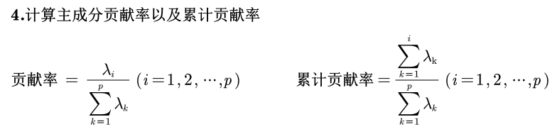

# 主成分分析

本讲将介绍主成分分析(Principal Component Analysis,PCA)， 主成分分析是一种**降维算法**，它能将多个指标转换为少数几个主成分，这些主成分是**原始变量的线性组合**，且彼此之间**互不相关**，其能反映出原始数据的大部分信息。一般来说， 当研究的问题涉及到**多变量且变量之间存在很强的相关性**时， 我们可考虑使用主成分分析的方法来对数据进行简化。

## 1 概述

### 1.1 问题的提出

​	在实际问题研究中，多变量问题是经常会遇到的。变量太多，无疑会增加分析问题的难度与复杂性，而且在许多实际问题中，多个变量之 间是具有一定的相关关系的。

​	因此，人们会很自然地想到，能否在相关分析的基础上，**用较少的新变量代替原来较多的旧变量**，而且使这些较少的新变量尽可能多地保留原来变量所反映的信息？

​	 事实上，这种想法是可以实现的，**主成分分析**方法就是综合处理这种问题的一种强有力的工具。 

​	==主成分分析是把原来多个变量划为少数几个综合指标的一种统计分析方法==。 

​	从数学角度来看，这是一种降维处理技术。

### 1.2 数据降维的作用

​	降维是将**高维度的数据**（指标太多）保留下最重要的一些特征，去除**噪声和不重要的特征**，从而实现提升数据处理速度的目的。 

​	在实际的生产和应用中，降维在一定的信息损失范围内， 可以为我们节省大量的时间和成本。降维也成为应用非常广泛的数据预处理方法。 

降维具有如下一些优点： 

- 使得数据集更易使用； 
- 降低算法的计算开销； 
- 去除噪声； 
- 使得结果容易理解。

> 举例：
>
> 

## 2 思想


> 

## 3 步骤


1. 标准化

   > 标准化与归一化的区别：
   >
   > - 标准化：去除**量纲**的影响
   > - 归一化：将数据规约到$(0,1)$，方便对结果进行解释

   

   > 这里使用的是Z-score标准化

2. 协方差

   

   > 
   >
   > 编程的时候直接去求**pearson相关系数**就好
   >
   > 主成分分析本身就比较适合**相关性很强**的，通过相关系数矩阵也可以看出来 

3. 特征值和特征向量

   

   > `np.linalg.eig(A)`，得到的特征向量应该都是标准化过的

   > 样本相关系数矩阵，主对角线元素都是1，所以迹为p，也是特征值之和

4. 贡献率

   

   > 上面说了，特征值之和是p，所以这里的分母就是p

5. 主成分

   

   > 特征向量作为系数，与原来的指标做线性组合

6. 分析主成分意义

   

   > 具体的分析方式可以看下面的例子

7. 后续分析

   

## 4 实践

### 4.1 例题1


> 这里没必要说相关系数显著性，因为这只是为了数据降维


> :star:主成分分析的说明
>
> 

### 4.2 例题2


> 这里只列出了累计贡献率很高的两个指标，自己写论文的时候还是把8个指标都列出来


### 4.3 例题3

Python实现主成分分析：

```python
import pandas as pd
from scipy.stats import zscore
import numpy as np
import seaborn as sns

np.set_printoptions(precision=4,suppress=True)

x = pd.read_excel('dataset\\data1.xlsx', header=None).values
n, p = x.shape
# Step one & two 标准化，计算协方差
X = zscore(x)
R = np.cov(X.T)
# print(R)
# 合并成一步，计算相关系数矩阵
R = np.corrcoef(X.T)
print('样本相关系数矩阵为：')
print(R)
sns.heatmap(R, vmin=-1, vmax=1, cmap='RdBu', annot=True)

# 处理特征值与特征向量，这里的处理方法值得注意
lambda_, V = np.linalg.eig(R)
V = V[:,lambda_.argsort()[::-1]]
lambda_ = np.sort(lambda_)[::-1]

print('特征值为：')
print(lambda_)

contribution = lambda_/lambda_.sum() 
print('贡献率为：')
print(contribution)

cum_con = lambda_.cumsum()/lambda_.sum()
print('累计贡献率：')
print(cum_con)
print(V)

# 得到新的样本主成分指标矩阵
m = 2 # 主成分个数
X @ V[:, :m]
```


## 5 滥用问题


## 6 应用

### 6.1 聚类


### 6.2 回归


