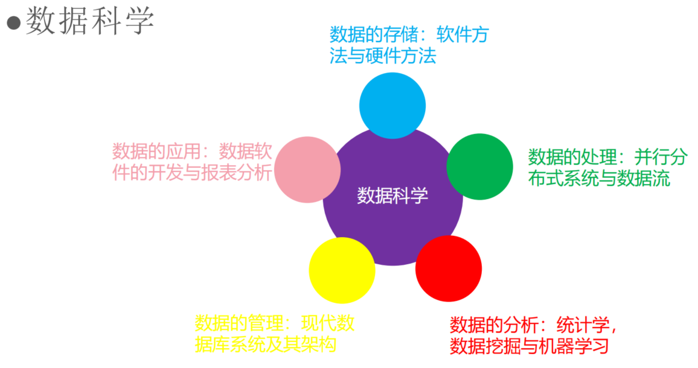
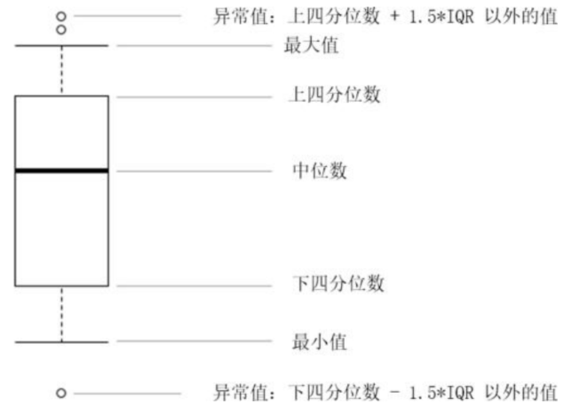
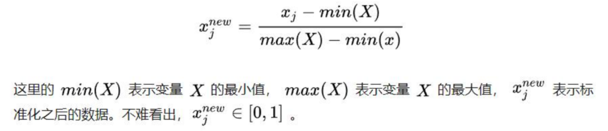
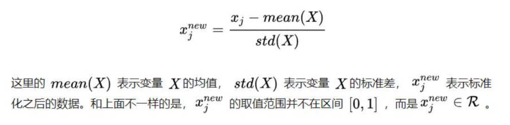

# 数据处理的基本策略

## 1 什么是数据

### 1.1 什么是数

数字是人类用于表示计数的工具，原始时代就有了

毕达哥拉斯说：“万物皆数”

除了“有几个”，各种物理量、化学量也可以用数表示

数包括自然数、整数、正数、负数、实数、有理数、复数等

实际上，有很多你想象不到的东西都可以**数化**

### 1.2 什么是数据

我们每个人都生活在数据当中 

抖音的点击量是数据，视频本身是数据，评论是数据 

> 视频本身就是图像的堆积，图像可以数字化

甚至每个人的电话号码，姓名，QQ号都可以称为数据 

数据不仅仅是一张excel表格这么简单 

也不是只有excel表格才配称为数据 

什么是数据这个问题上我们不学意大利人不吃菠萝披萨

凡是**能够用数来量化的信息**都可以称为数据 

数字表格是数据：财报，成绩单，工业仪表记录…… 

图像与视频也是数据：数字图像处理把像素点数字化 

自然语言文本也是数据：微博文本，头条新闻，甚至唐诗 

波形信号更是数据：地震波，电磁波，机械振动，音乐…… 

数据的格式也有很多： 

- jpg,png,mp4,avi,txt,csv,tsv,xlsx,json,txt……

### 1.3 数据的基本特征

包含了**可以量化的信息**，能够做分析 

能够通过一些对应的手段用数字进行量化 

能够从数据中提取出有用信息 

数据能够反映描述对象的基本情况 

数据能够被计算机读取、写入、存储、处理、分析、管理

### 1.4 数据科学

- 数据存储
- 数据处理：多快好省
- 数据分析
- 数据管理
- 数据应用

### 1.5 数据的属性

在前面的学习中我们知道离散的概念与连续的概念 

- **离散**：取值是有限的，不光是0-1规划这样的数字，{猫，狗}这样的有限词汇集合也可以构成离散特征 
- **连续**：取值是无限的，通常为实数，比如173.52cm等 

通常数据的属性就是**离散类属性**和**连续类属性**两个大类

### 1.6 数据量与数据维度

数据量：

- 数据量从直观而言，你可以认为在一个excel表格里面有多少行 
- 也可以认为这份数据在计算机内占有多大的一块存储空间 
- 依个人经验，小于1000行的excel表格都只配叫小体量数据、1000-20000算中体量、20000-1000000是大体量（excel的上限就一百多万） 、一百万以上的时候可以考虑选择使用云服务资源 
- 100以下是微数据，这种情况下不要想机器学习这些花哨的方法

数据维度：

- 你可以理解为excel表格有多少列 
- 每一列分别是什么数据量，属性如何 
- 如果是图像数据那么这个图像的大小多少 
- 如果是文本数据需要把文本做向量化 
- 如果是信号数据那么通常来讲维度并不会太高 
- 数据稀疏：拿你们最熟悉的excel举例子：列/行>0.5的时候

### 1.7 数据的模态

> 描述数据的一种形式

数值表，文本，图像，视频，音频等都可以作为**模态** 

- 如果两个数据集里面的**模态不一样**，但都是对**同一个事物**做描述，那么这两个数据集是**异质模态** 

- 如果一个数据包含不同模态的信息，或者模型利用不同模态的数据综合分析，我们称其为**多模态**

  > 比如视频与音频的结合

### 1.8 数据库与爬虫

爬虫是就是一个**程序**，这个程序的任务就是从给出的一组种子***UR***L开始爬取网页，并通过网页间的**链接**爬取更多的网页，根据爬虫任务的需求，最终可能会爬取整个互联网的网页。 

数据库是**数据管理的有效技术**，是由**一批数据构成的集合**，这些数据被存放在结构化的数据表里。数据表之间相互关联，反映客观事物间的本质联系。数据库能有效地帮助一个组织或企业科学地管理各类信息资源。

### 1.9 表格数据

excel,csv,tsv数据 ：

- 但是excel编码单一，而且行数上限**只有108万** 

  > 一则英式笑话：英国21年年初没有任何新增COVID-19病例 ,
  >
  > 因为Microsoft Excel封顶108万个病例，新增的数据根本导不出来，笑死 

- csv就没有这个**上限限制**了，即使转成txt也可以读取 

- csv用逗号分割，tsv用Tab键分割

excel的基本使用：

- 输入数据 
- 统计数据 
- 求和、筛选等操作 
- 绘图 
- ...

## 2 数据预处理

### 2.1 为什么需要数据预处理

在现实生活问题中，我们得到的原始数据往往非常混乱、不全面，机器学习模型往往无法从中有效识别并提取信息。**数据和特征决定了机器学习的上限，而模型和算法只是逼近这个上限而已**，在采集完数据后，机器学习建模的首要步骤以及主要步骤便是**数据预处理**。

- 各特征(变量)的尺度(量纲)和数量级差异大
- 存在噪声：包含错误和异常值
- 存在缺失值
- 存在冗余特征(变量)

### 2.2 数据预处理方法

数据的空缺、重复：

- 空缺

  - 直接删除

    - 5%以内空缺可以直接删除 

    - 30%以上空缺删除数据列

      > 因为在这种情况下，填充的精度会很低

  - 使用插值、预测等方法补充

    > 数据的空值填充方法 ：
    >
    > - 常数填充：-1填充；0填充；均值填充等 
    > - 插值填充：各种插值方法，前向，后向等 
    > - 预测填充：利用机器学习算法做预测

    - 10%以内的空缺可以按照常数法填充 

      > 0、-1、中位数、平均数

    - 10%-30%以内的空缺可以机器学习填充 

      > 比如把空缺列当成因变量，其他不空缼的列当成自变量

    - 离散数据填充：空缺值有时可以当做一个特殊类 

      > 比如性别，只有男女，如果缺失了，可以按照**众数**填充，也可以直接把“性别未知”当作一个特殊类

    - 连续数据填充：插值方法前向后向是**时序性**时才能用 

- 重复

  - 根据相关系数，去重

  - 去重有助于我们降低样本失衡影响 

  - 去重有助于降低模型计算量 

  - 横向去重和纵向去重

    > 这里的“横”和“纵”指的就是一张数据表的直观看法

异常点：

- 什么是异常点

  - 远远超过均值或者低于均值的点 

  - 结果不符合常理的点 

  - 究竟这个异常点是**偶然错误**还是**意外发现** 

    > 偶然错误的处理方法：置空或者删除

- 判断异常点

  - 箱线图

    

### 2.3 数据规约

> 也**数据归一化**的方法

数据规约的目的：

- 对特征的规约：抛弃冗余特征 
- 对数值的规约：数据的分布有偏；数据的范围波动大 
- 形成对数据的更高效表示，能够学习到更好的模型 
- 保留原始数据之间的关系，但是对异常值、极端值比较敏感。

数据**规约**方法：

- **min-max规约**

  

  > 将数据范围规约到0和1之间

- Z-score规约

  

  > 让数据收拢，近似符合正态分布

## 3 插值与拟合

[插值与拟合](插值与拟合/README.md)

## 4 数据可视化

之后再详细学

