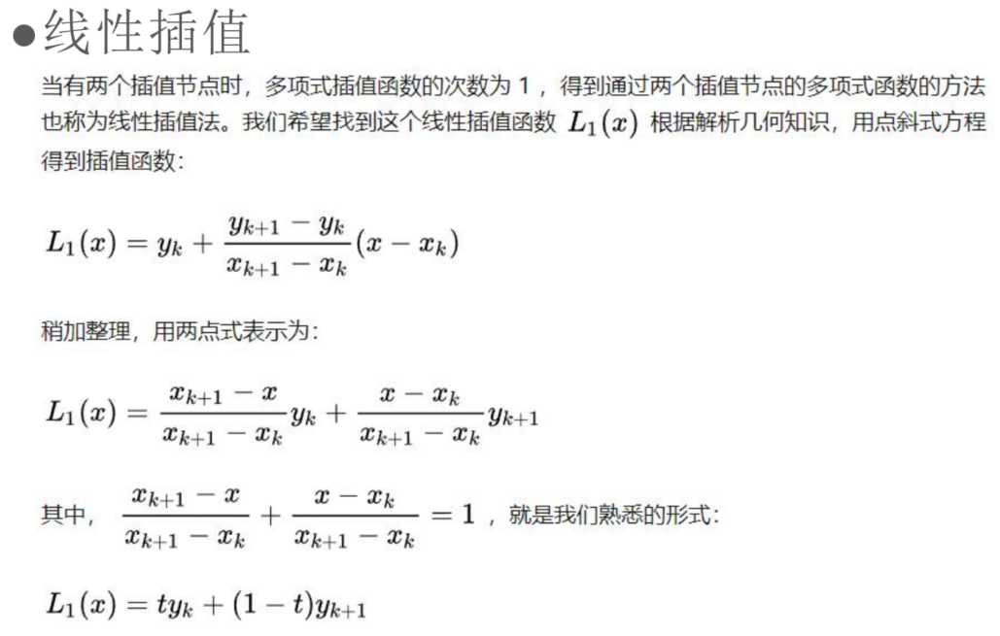
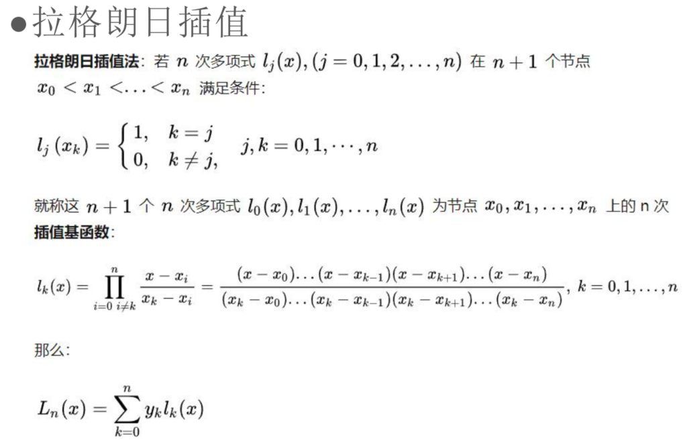
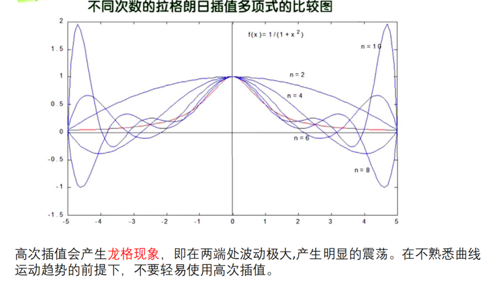
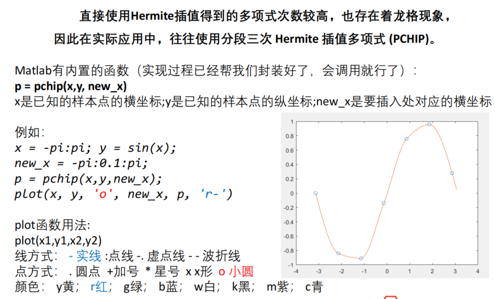
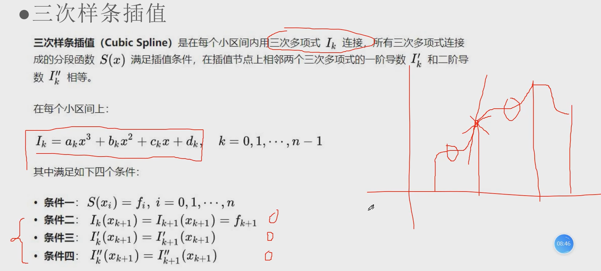
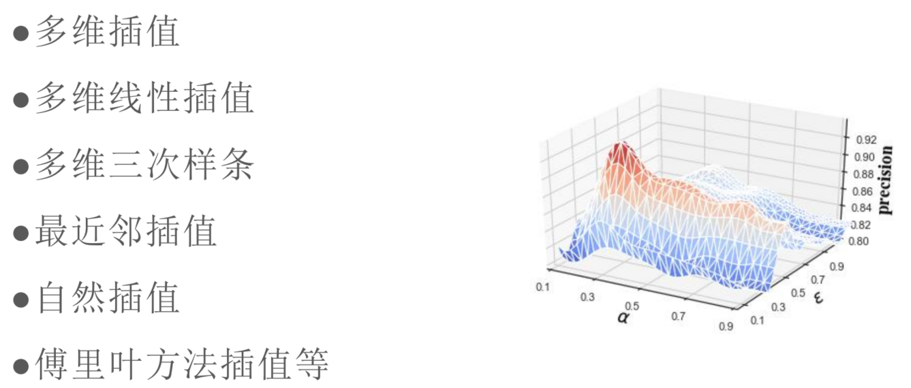
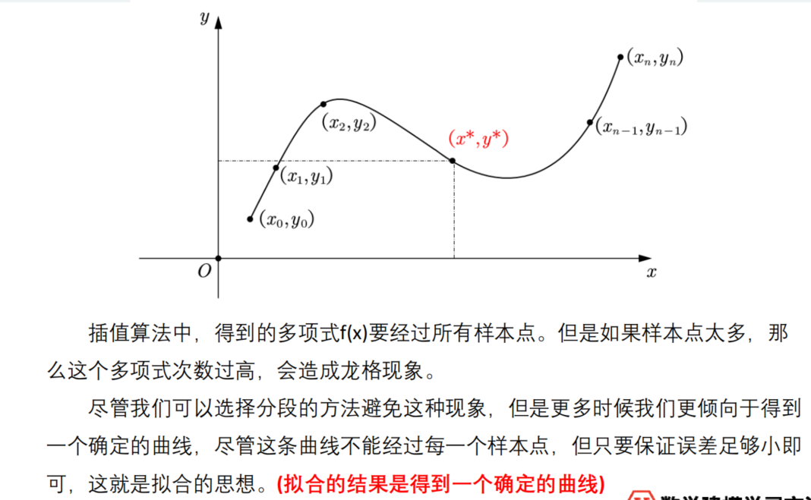
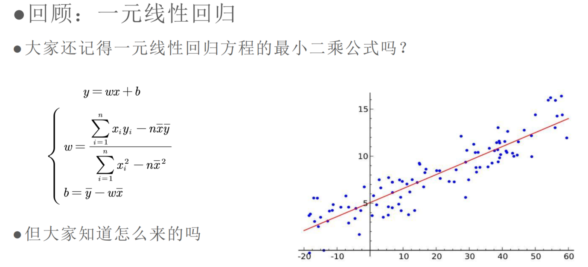
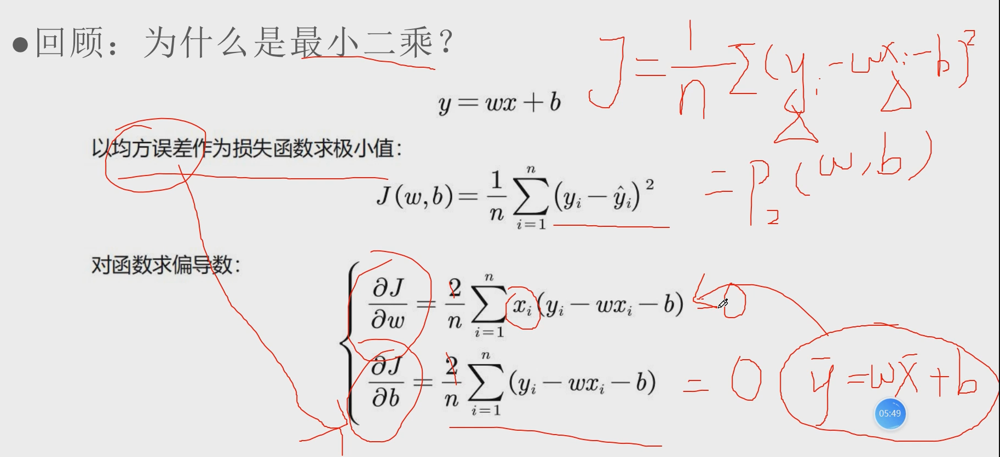

## 3 插值与拟合

### 3.1 插值

> 详见《计算方法》
>
> > 样条插值没讲，我是:black_joker:

<u>概述</u>：

- 常用在随时间变化的数据的插值上
- 常数插值：0插值、均值插值、中位数插值等 
- 前向后向插值等需要在**时序数据**中用
- 插值一般都是两边的数据有，中间的数据没有；如果是通过中间的数据得到两边的数据，一般是**拟合**与**预测**

<u>线性插值</u>：



<u>拉格朗日插值</u>：



> 

:star:<u>分段三次Hermite插值</u>：

>pchip_interpolate

> 分段，四个点做成一个三次函数



:star:<u>三次样条插值</u>：

> 效果较好，但形式复杂

> 每个小区间内都做一个**三次函数**，各相邻小区间三次函数要在**邻接点**满足一些条件



> 条件二到四可以构成一个**三元一次方程组**

<u>多维插值</u>：



<u>Python插值</u>：

```python
from numpy import arange
from scipy.interpolate import interp1d, lagrange, PchipInterpolator
import matplotlib.pyplot as plt

x0 = [1, 2, 3, 4, 5]
y0 = [1.6, 1.8, 3.2, 5.9, 6.8]
f1 = interp1d(x0, y0, 'linear') # 分段线性插值/一次样条插值
f2 = interp1d(x0, y0, 'cubic') # 三次样条插值
f3 = lagrange(x0, y0) # lagrange插值
f4 = PchipInterpolator(x0, y0) # 分段三次hermit插值

x = arange(1, 5, 1/30)
y1 = f1(x)
y2 = f2(x)
y3 = f3(x)
y4 = f4(x)

plt.plot(x0, y0, 'r*')
plt.plot(x, y1, 'b-', x, y2, 'y-', x, y3, 'r-', x, y4, 'g-')
plt.show()
```

### 3.2 拟合

> 插值与拟合的区别：
>
> 

<u>一元线性回归：</u>





> 就是每个数据点与拟合直线的纵向距离之和（的平方）要最小，这也就是均方误差，作为**损失函数**，然后求多元函数极值点（要把$\hat y=wx+b$代入）

> 多项式拟合：
>
> - 同样，假设函数是多项式形式 
> - 写出最小二乘法，对其求偏导即可

<u>Python**多项式**拟合</u>：

```python
import numpy as np
x = np.arange(-1.5, 1.6, 0.5)
y = [-4.45, 0.45, 0.55, 0.05, -0.44, 0.54, 4.55]
an = np.polyfit(x, y, 3)
print(an)
p1 = np.poly1d(an)
print(p1)
```

<u>Python指对数拟合</u>：

- 指数函数与对数函数实际上可以通过对数或者指数变换转化为线性拟合或者多项式拟合 

另外除了numpy，statsmodels当中也提供了OLS(Odinary Least Squares)方法可以用于线性回归

```python
import numpy as np
import statsmodels.api as sm
# 1 生成四维数据点
# 1.1 生成自变量
x1 = np.random.normal(0, 1, 1000)
x2 = np.random.normal(0, 1.5, 1000)
x3 = np.random.normal(0, 2, 1000)
X = np.c_[x1, x2, x3]
# 1.2 生成因变量
eps = np.random.normal(0, 0.3, 1000) # 噪声数据
c = [1, 2, 3]
y = X @ c + eps
# 2 利用生成的数据点拟合
model = sm.OLS(y, sm.add_constant(X))
res = model.fit()
res.summary()
```

>OLS指的是普通最小二乘法模型，也就是**线性**的

<u>Python曲线拟合</u>：

```python
from numpy import arange, array
from scipy.optimize import curve_fit

# 1 先有数据点
X = arange(1, 11, 1)
Y = array([1.1, 2.5, 3.6, 4.9, 6.2, 9.0, 9.5, 11.0, 15.6, 14.1])
# 2 猜测拟合曲线
def f(x, a, b):
    return 1/(a + b*x)
# 3 拟合
popt, pcov = curve_fit(f, X, Y)

plt.scatter(X, Y)
plt.plot(X, f(X, *popt), 'b-')
plt.show()
```

> 总结一下拟合可用的api：
>
> - 线性拟合：`statsmodels.api.OLS`、`numpy.poly1d`、`scipy.optimize.curve_fit`
> - 多项式拟合：`numpy.poly1d`、`scipy.optimize.curve_fit`
> - 一般曲线拟合：`scipy.optimize.curve_fit`