# 假设检验

## 1 概述

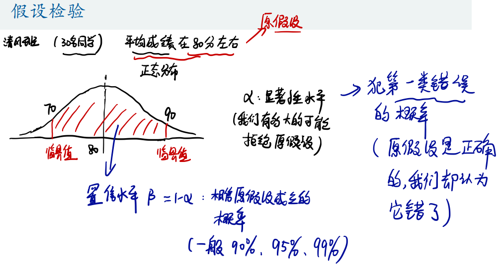

- 置信水平和显著性水平

## 2 假设检验步骤

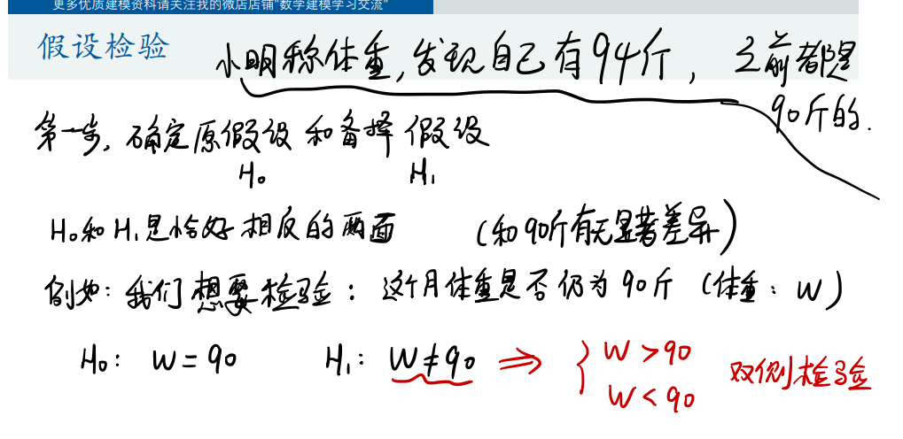

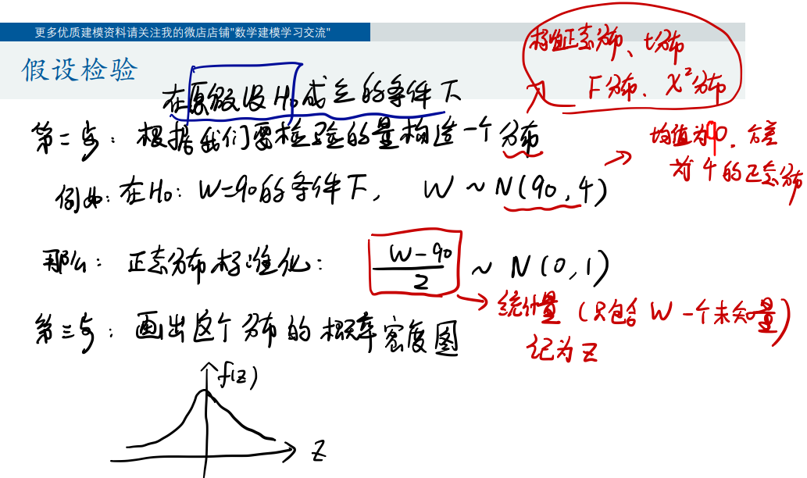

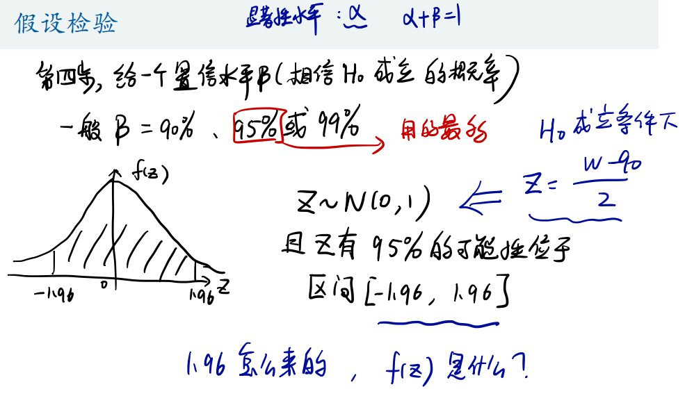

> 总结：
>
> 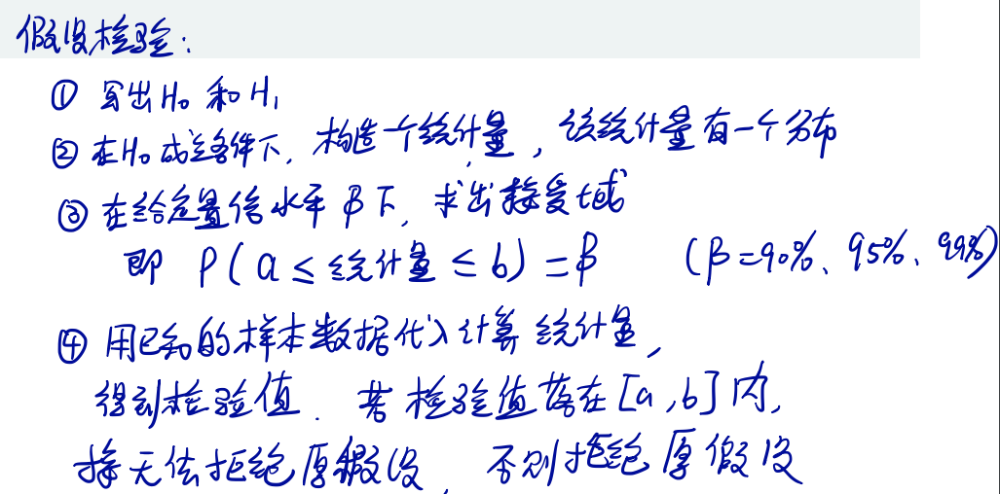
>
> 其中的难点就是**构造一个合适的分布**

## 3 常见函数

### 3.1 概率密度函数

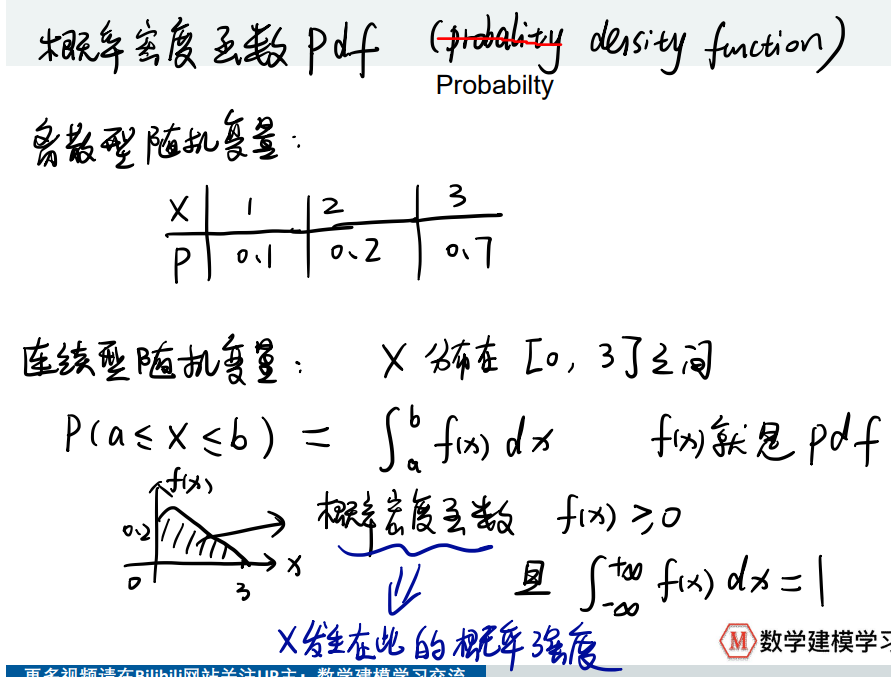

> 计算举例：
>
> 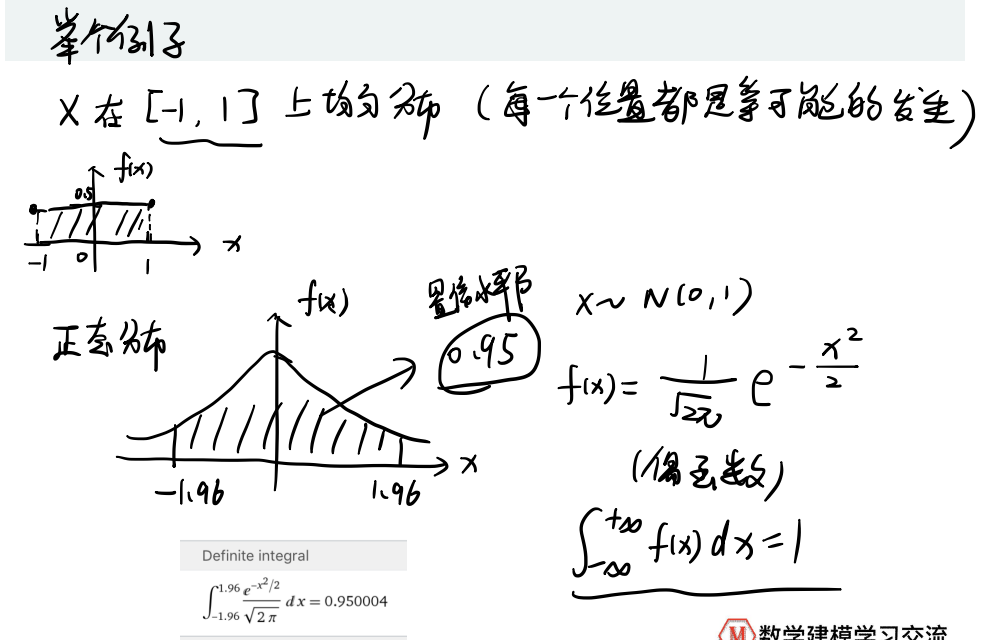

### 3.2 累积密度函数

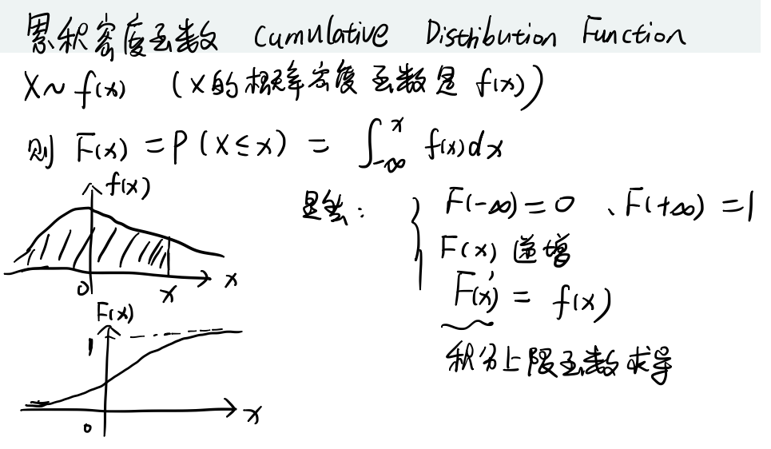

> 上面例子中的1.96怎么来的
>
> 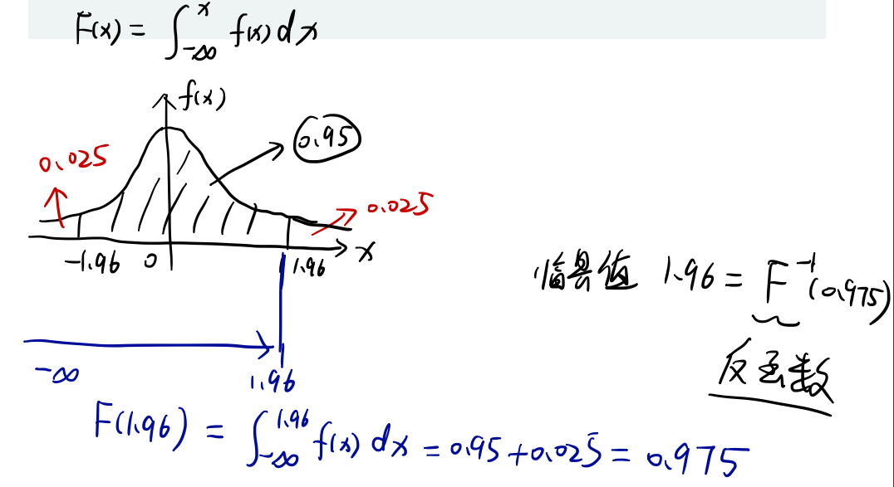
>
> **累积密度函数的反函数**

## 4 接受与拒绝

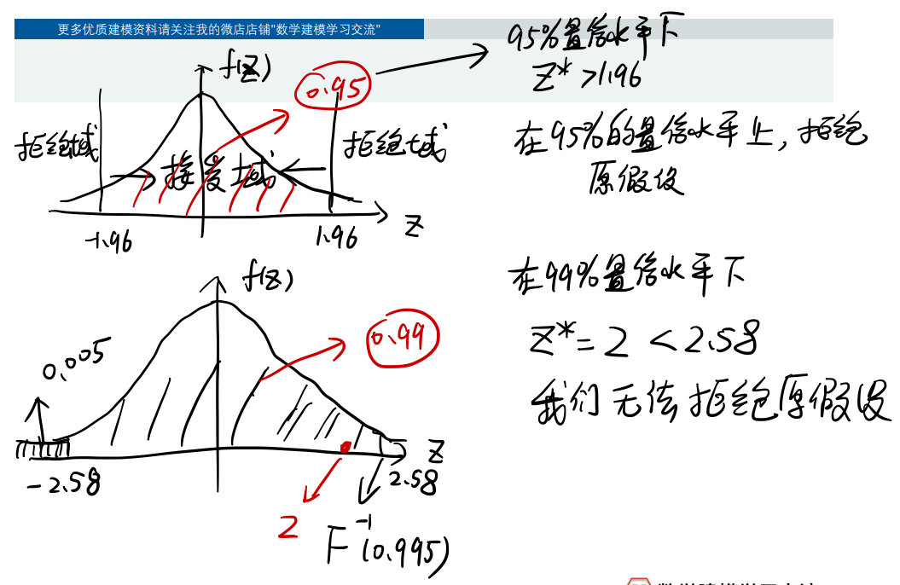

> 所以，置信水平的不同可以导致结论的不同

> 如果换成单侧检验：
>
> 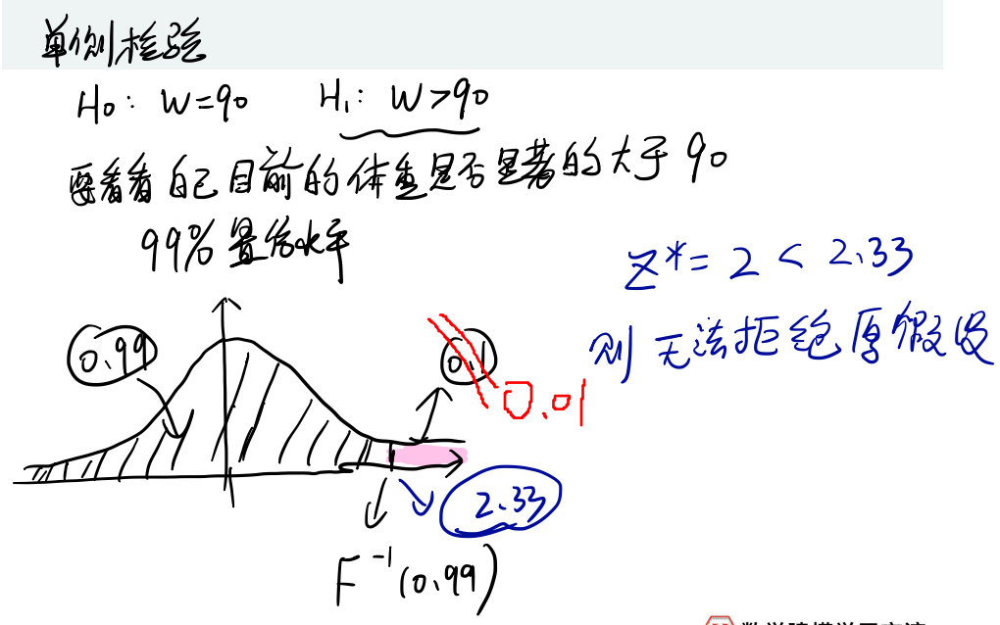

> :star:使用P值简化计算：得到检测值后，直接比较面积
>
> 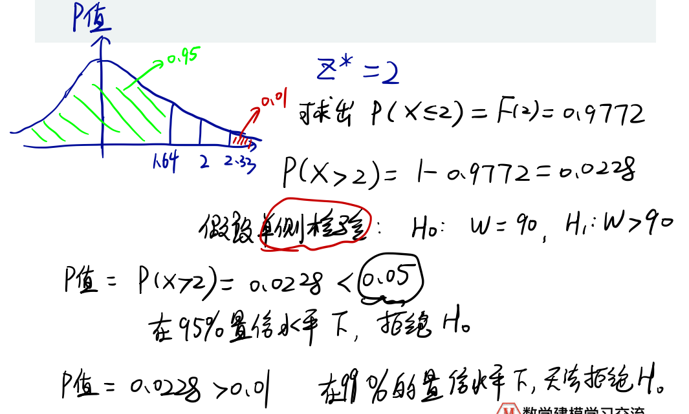
>
> 

> :star:总结：
>
> 要先弄清原假设是什么
>
> 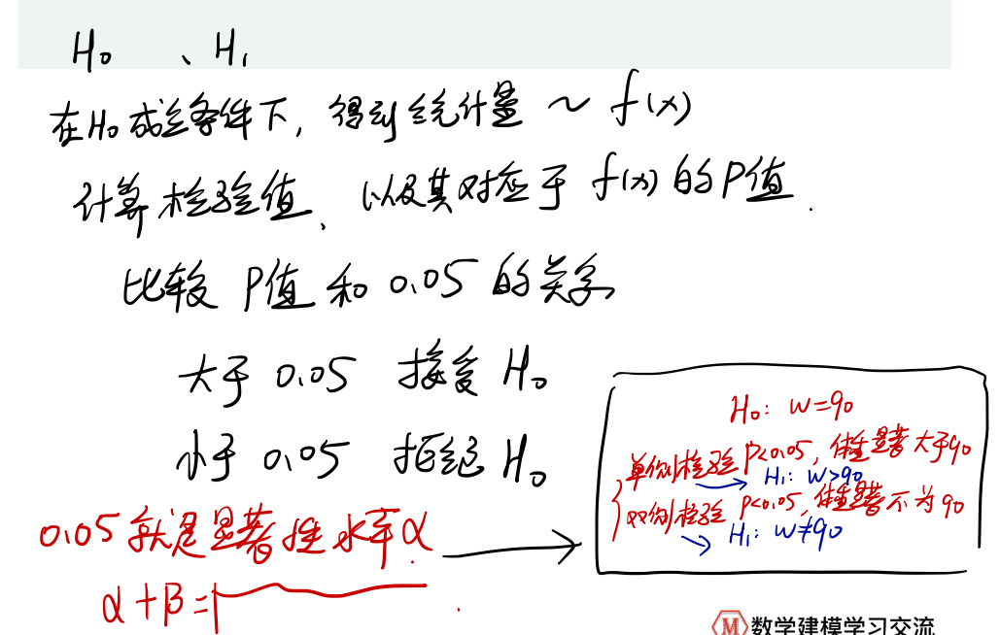