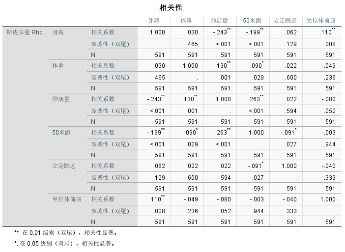

# 假设检验

## 1 理论部分

### 1.1 概述


- 置信水平和显著性水平

- 我自己理解的，假设检验的根本原理是：

  在**假设成立**的情况下，用要检验的量经过数学变换构造出来的一个量应该服从某种**分布**，那怎么看是不是符合这种分布呢？首先要有一个**置信水平**，然后随机检测一次，看看这一次的值**在不在这种分布能接受的范围内**，如果在，则不能拒绝假设，如果不在，则可以直接拒绝假设

  > “能接受的范围”和我们**置信程度**有关，越是相信，能接受的范围越大，拒绝假设的概率越小。与此同时，一旦检测值超出范围（一般都是小概率事件），我们往往会直接拒绝假设（一般认为小概率事件“不会发生”，是因为假设错了才会发生）

### 1.2 假设检验步骤


> 总结：
>
> 
>
> 其中的难点就是**构造一个合适的分布**

### 1.3 常见函数

#### 1.3.1 概率密度函数


> 计算举例：
>
> 

#### 1.3.2 累积密度函数


> 上面例子中的1.96怎么来的
>
> 
>
> **累积密度函数的反函数**，一般来说需要**查表**，那能不能不这么麻烦地去查表？下面会介绍一种P值判断法，更方便

### 1.4 接受与拒绝


> 所以，置信水平的不同可以导致结论的不同

> 如果换成单侧检验：
>
> 

> :star:使用P值简化计算：得到检测值后，直接比较面积
>
> 
>
> 

> :star:总结：
>
> 要先弄清原假设是什么
>
> 

## 2 对pearson相关系数进行假设检验

### 2.1 步骤


- 用Python求t分布的pdf：`scipy.stats.t.pdf`


- https://wenku.baidu.com/view/d94dbd116bd97f192279e94a.html
- `scipy.stats.t.ppf`也可以


- 所以要反着假设，这样才可以直接否定，不然只能得出“无法拒绝”的结论

### 2.2 方法改进：P值


- 用Python求t分布的pdf：`scipy.stats.t.cdf`

- 注意区分单侧检验还是双侧检验，从而确定是否乘以2

- `*`的含义：比如算出了pearson相关系数为0.5

  - $0.5$代表不显著，不能拒绝相关系数等于0
  - $0.5^*$代表在90%置信水平上显著，能拒绝相关系数等于0
  - $0.5^{**}$代表在95%置信水平上显著，能拒绝相关系数等于0
  - $0.5^{***}$代表在99%置信水平上显著，能拒绝相关系数等于0

  > 所以*越多越有意义

### 2.3 Python求解

举例：

```python
# corr and p-value matrix
from scipy.stats import pearsonr
import pandas as pd
import numpy as np

dataframe = pd.read_excel('dataset/八年级女生体测数据.xlsx', sheet_name='Sheet1')
data = dataframe.values

cnum = len(data[0])
p_mat = np.ones((cnum,cnum))
corr_mat = np.ones((cnum,cnum))
for i in range(cnum):
    for j in range(cnum):
        (corr_mat[i][j], p_mat[i][j]) = pearsonr(data[:,i], data[:,j])
print(np.round(corr_mat,4))
print(np.round(p_mat,4))
p_mat_star = np.where(p_mat<0.01, '***', p_mat)
p_mat_star = np.where(np.logical_and(p_mat>=0.01,p_mat<0.05), '* *', p_mat_star)
p_mat_star = np.where(np.logical_and(p_mat>=0.05,p_mat<0.1), ' * ', p_mat_star)
p_mat_star = np.where(p_mat>=0.1, '   ', p_mat_star)
p_mat_star
```


> 还要加上一句话`***p<0.01, **p<0.05, *p<0.1`

也可以作用SPSS软件：

- 【分析】【相关】【双变量】【双尾】

  

  > 这个图可以放到论文里

### 2.4 pearson相关系数假设检验的条件

第一， 实验数据通常假设是成对的来自于**正态分布**的总体。因为我们在求皮尔 逊相关性系数以后，通常还会用t检验之类的方法来进行皮尔逊相关性系数检验， 而t检验是基于数据呈正态分布的假设的。 

第二， **实验数据之间的差距不能太大**。皮尔逊相关性系数受异常值的影响比较大。 

第三，每组样本之间是**独立抽样**的。构造t统计量时需要用到。

第二点和第三点可以默认做到，那如何检验数据是否是正态分布？

## 3 正态分布检验

### 3.1 JB检验

#### 3.1.1 基本原理


> 
>
> `scipy.stats.kurtosis`定义正态分布的峰度为0


> 默认置信水平是95%，所以这里与0.05比较

#### 3.1.2 Python进行JB检验

```python
from scipy.stats import jarque_bera
import pandas as pd
import numpy as np

dataframe = pd.read_excel('dataset/八年级女生体测数据.xlsx', sheet_name='Sheet1')
data = dataframe.values
stat = np.zeros(len(data[0]))
pval = np.zeros(len(data[0]))
# 注意要求样本数量大于30
for i in range(len(data[0])):
    stat[i], pval[i] = jarque_bera(data[:,i])
print(np.round(stat, 6))
print(np.round(pval, 6))
```

### 3.2 Shapiro-wilk检验


> 可以使用`scipy.stats.shapiro`，下面用SPSS演示


### 3.3 Q-Q图


Python画Q-Q图：

```python
from scipy.stats import probplot
import numpy as np
import matplotlib.pyplot as plt

x = np.random.normal(2, 3, 100000)
probplot(x, plot=plt)
plt.show()
```

> 不太推荐直接看Q-Q图

## 4 对spearman相关系数进行假设检验

4.1 小样本


大样本：


> 在大样本情况下，如果H~0~成立，则构造出来的统计量符合正态分布

- `scipy.stats.spearman`会同时返回相关系数和p值

- 使用SPSS软件：

  

  

  


