# 典型相关分析

典型相关分析（Canonical Correlation analysis） 研究**两组变量**（每组变量中都可能有**多个指标**） 之间相关关系的一种多元统计方法。它能够揭示 出两组变量之间的内在联系。 

> 温馨提示：这一讲涉及到多元统计的知识，如果对原理听不懂也没 关系，等以后学完了主成分分析模型后再回过头来看比较合适。

## 1 概述

### 1.1 例子

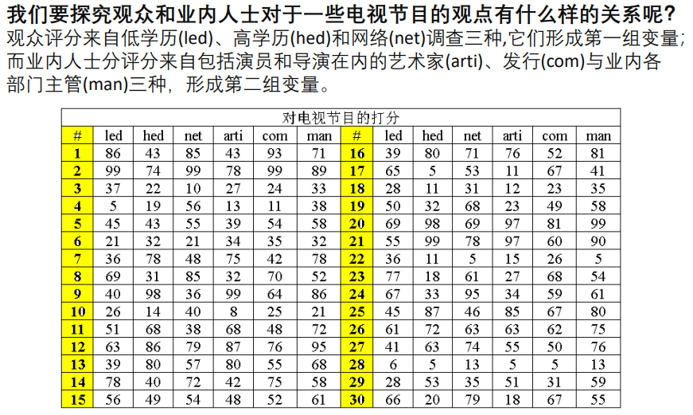

解决思路：

- 把多个变量与多个变量之间的相关化为**两个具有代表性的变量**之间的相关。
- 代表：能较为**综合、全面**地衡量所在组的内在规律。 
- 一组变量最简单的综合形式就是该组变量的**线性组合**。

### 1.2 定义

典型相关分析由Hotelling提出，其基本思想和主成分分析非常相似。 

1. 首先在每组变量中找出变量的线性组合，使得两组的线性组合之间具有最大的相关系数；

2. 然后选取和最初挑选的这对线性组合不相关的线性组合，使其配对，并选取相关系数最大的一对；

3. 如此继续下去，直到两组变量之间的相关性被提取完毕为止。 

   > 提取完毕：可以用假设检验，直到相关性不显著

被选出的线性组合配对称为**典型变量**，它们的相关系数称为**典型相关系数**。典型相关系数度量了这两组变量之间联系的强度。

## 2 思路

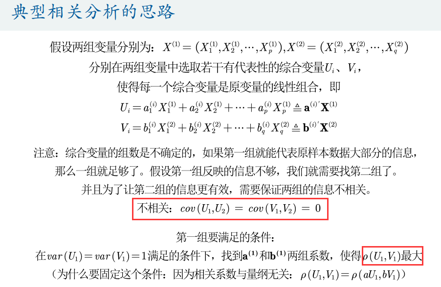

> 重点：第一组的两个代表的**相关系数最大且显著**，之后组的代表与之前的代表**不相关**

证明过程：

- 目标是：

  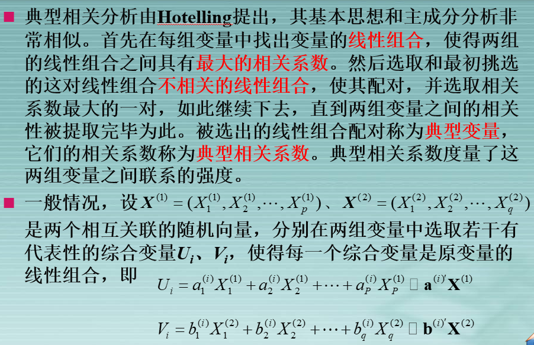

  > 怎么做到最大呢？需要用比较复杂的公式

- 求第一对的条件：

  - 方差规定为1
  - 相关系数最大

- 求之后对的条件

  - 满足第一对的条件
  - 与之前对不相关，也就是**协方差为0**

- 根据约束条件求解：很复杂的求解，但其中有些重要结论需要知道

  - 代表对的系数对应于一个特征值的**特征向量**
  - 构造出来的A和B**特征值**相同，非负，其平方与**相关系数**相等（当然也在0~1内）
  - **第n典型相关系数**刚好对应**第n大**A和B**特征值的算术平方根**

  > 当然，实际情况都是用样本去估计总体的

- 检验相关系数显著性

  - 首先样本要符合正态分布
  - 其实就是检验是否显著不为0，按照从大到小的顺序检验，如果有一个不能拒绝为0了，那后面肯定都不能拒绝为0（这里好像有点不严谨，但who cares，我不理解的地方多了）

## 3 实践

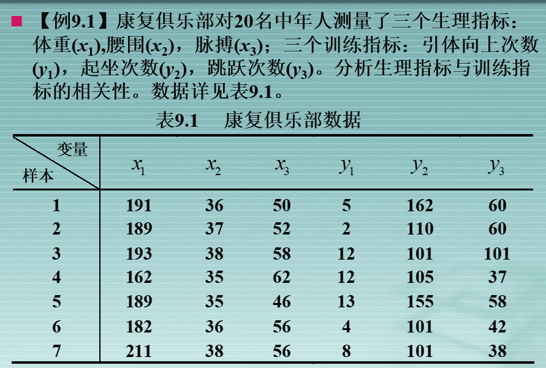

- 协方差矩阵与特征值

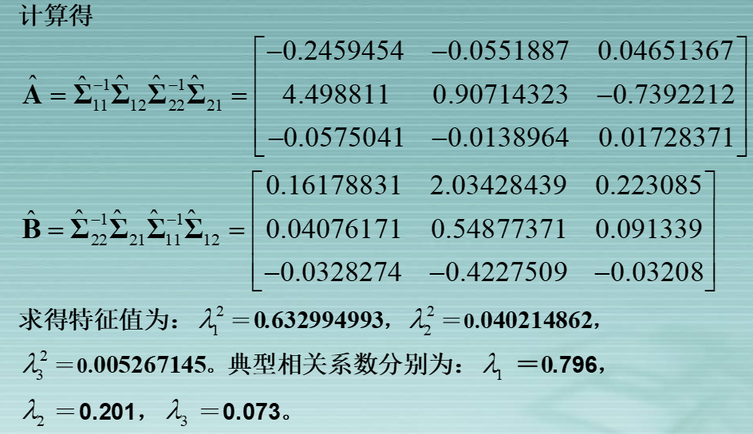

- 检验

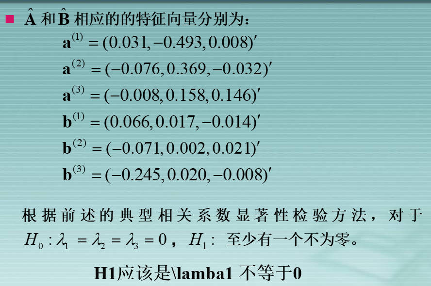

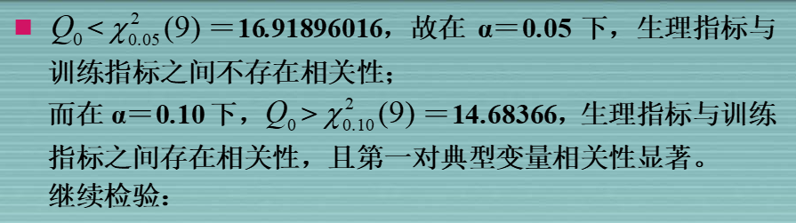

> 调整置信水平，让相关性显著

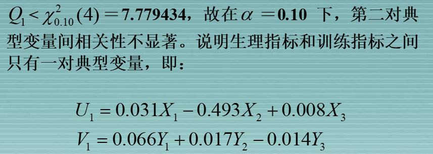

:star:操作步骤

1. 导入Excel数据到SPSS

   > 注意检查一下变量视图：
   >
   > - 标度：数字指标、标量
   >
   > - 有序：有序的分类
   >
   >   > 优良差；甲乙丙丁
   >
   > - 名义：无序的分类
   >
   >   > 男、女

2. 典型相关分析

   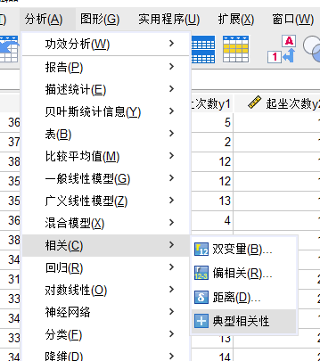

3. 导出为word，修改一些信息

   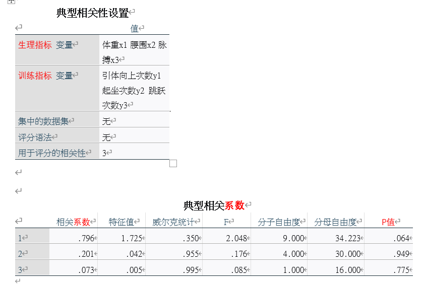

4. 分析P值，确定显著的相关性，找到对应的特征向量

   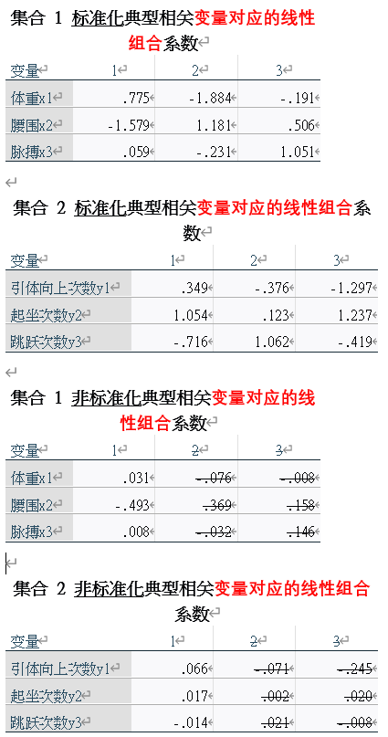

   > 非标准化的是没有去除量纲影响的，不能看出不同指标谁占的份额大，所以需要==标准化==
   >
   > 当然标准化前后，特征值是不变的，所以显著性也不变
   
5. 典型载荷分析

   见下文

## 4 补充

### 4.1 标准化

先将数据标准化，再求解

### 4.2 典型载荷分析

分析**原始变量**与**典型变量**之间的相关性

相关性的符号与线性组合系数的符号不一定相同，要看相关性还是要进行**典型载荷分析**

> 本质上是因为原始变量之间也不一定是独立的

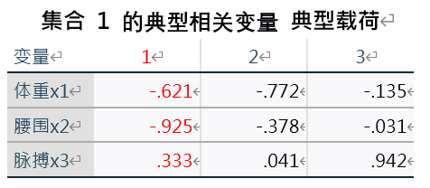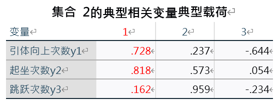

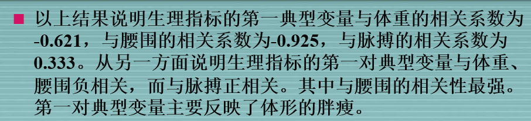

### 4.3 典型冗余分析

分析典型变量的**解释力**

> **在进行样本典型相关分析时，我们也想了解每组变量提取出的典型变量所能解释的该组样本总方差的比例，从而定量测度典型变量所包含的原始信息量的大小。**

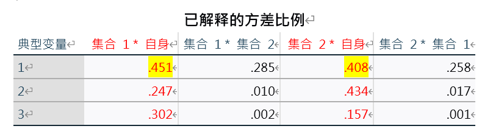

> 一般来说只看自身的就够了，高亮的是显著的

## 5 总结

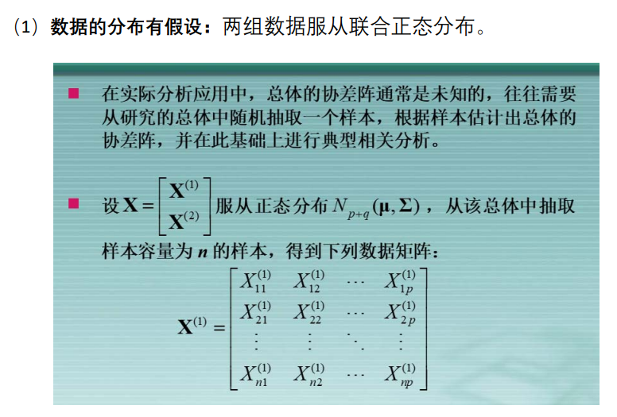

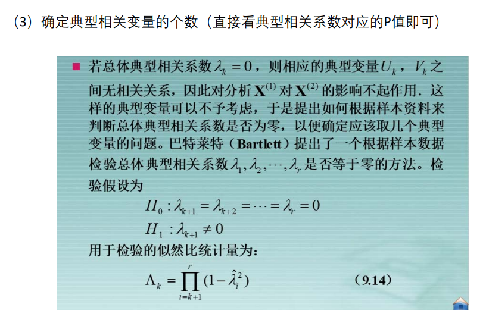

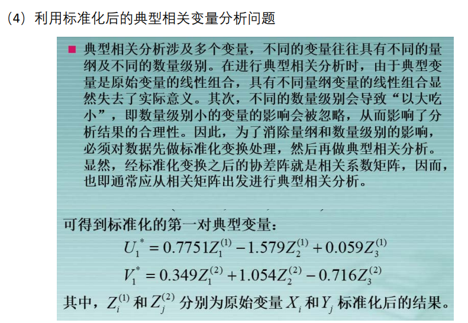

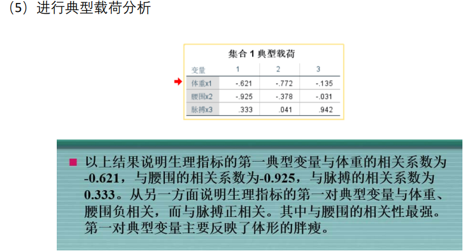

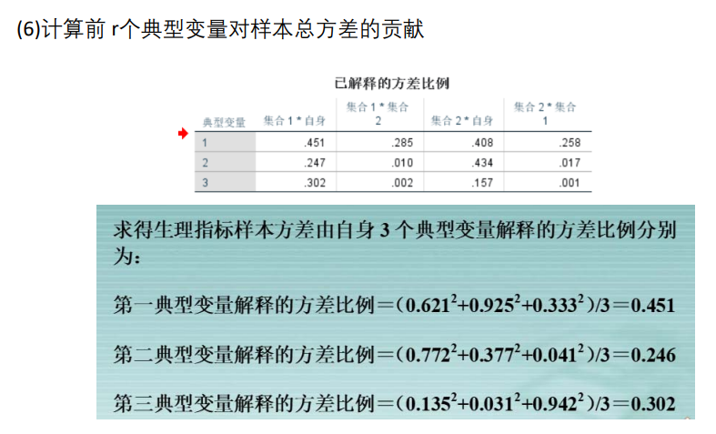

