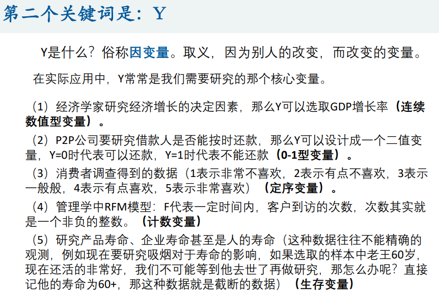
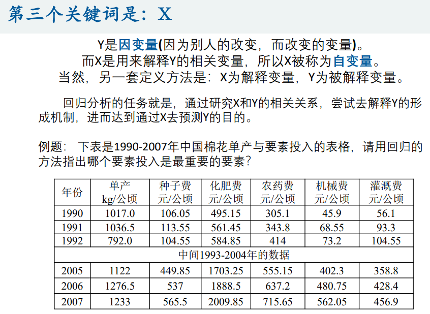
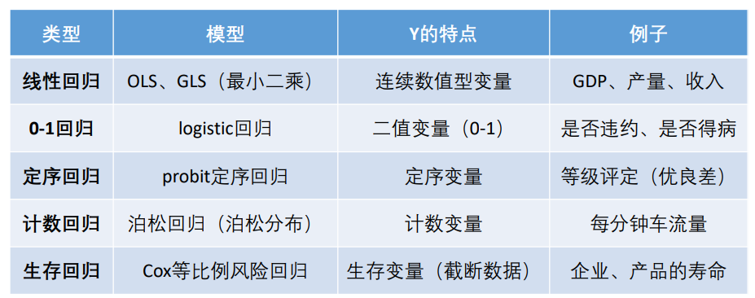

# 多元回归分析

回归分析是数据分析中最基础也是最重要的分析工具，绝大多数的数据分析问题，都可以使用回归的思想来解决。回归分析的任务就是， 通过研究自变量X和因变量Y的相关关系，尝试去解释Y的形成机制，进 而达到通过X去预测Y的目的。 常见的回归分析有五类：线性回归、0‐1回归、定序回归、计数回归 和生存回归，其划分的依据是因变量Y的类型。本讲我们主要学习线性回归。

## 1 概述

### 1.1 回归的思想

<u>回归分析</u>：研究X和Y之间相关性的分析。

<u>三个关键词</u>：

- 相关性
- X
- Y

<u>相关性</u>：

<u>Y</u>：

<u>X</u>：

### 1.2 回归的目的

使命1：回归分析要去识别并判断：哪些X变量是同Y真的**相关**，哪些不是。 统计学中有一个非常重要的领域，叫做“变量选择”。（逐步回归法） 

使命2：去除了那些同Y不相关的X变量，那么剩下的，就都是重要的、有用的X变量了。接下来回归分析要回答的问题是：这些有用的X变量同Y的**相关关系是正的呢，还是负的**？ 

使命3：在确定了重要的X变量的前提下，我们还想赋予不同X不同的权重， 也就是不同的**回归系数**，进而我们可以知道不同变量之间的相对重要性。 

> 当然赋予回归系数是需要**去除量纲影响**的（标准化）

这就是回归分析要完成的三个使命： 第一、识别重要变量； 第二、判断相关性的方向； 第三、要估计权重（回归系数）。

> 当然还有更多使命，比如回归系数是不是**显著**的，回归系数的置信**区间**是怎样的

### 1.3 回归分析的分类

## 2 线性回归

[线性回归](线性回归/README.md)

