# 线性回归

## 1 数据的分类和来源

### 1.1 分类

#### 1.1.1 横截面数据

同一时间，不同对象

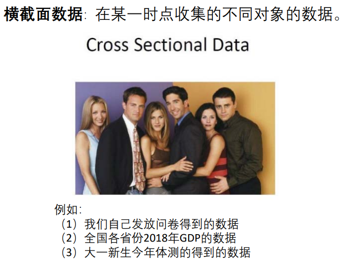

#### 1.1.2 时间序列数据

同一对象，不同时间连续观察

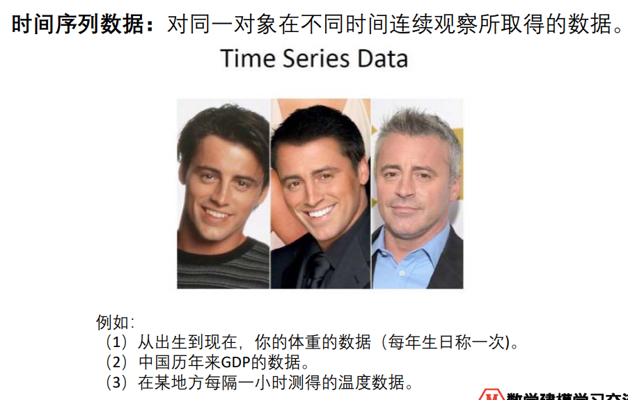

#### 1.1.3 面板数据

综合横截面与时间序列，连续时间序列多个对象

#### 1.1.4 不同数据类型的处理方法

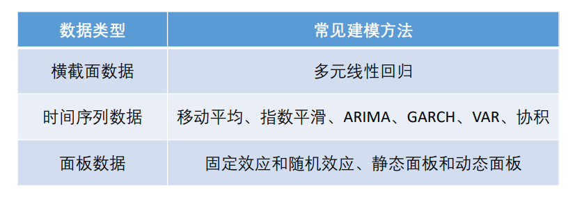

> 建模比赛中，前两种数据类型最常考到；面板数据较为复杂，是经管类学生在中级计量经济学中才会学到的模型。 
>
> 横截面数据往往可以使用回归来进行建模，我们通过回归可以得到自变 量与因变量之间的相关关系以及自变量的重要程度。 
>
> 时间序列数据往往需要进行我们进行预测，时间序列模型的选择也很多， 大家需要选择合适的模型对数据进行建模。

### 1.2 来源

【简道云汇总】110+数据网站 https://link.jiandaoyun.com/f/5cc652cc2cf3b22fb7819189 
虫部落数据搜索 http://data.chongbuluo.com/ 
【汇总】数据来源/大数据平台 https://link.jiandaoyun.com/f/5b35d05ff7f6ef2604d39a93 
大数据工具导航工具 http://hao.199it.com/ 
数据平台 http://www.hippter.com/data.html 

上面的数据多半都是**宏观数据**，**微观数据市面上很少**，大家可以在人大经济论坛搜索 https://bbs.pinggu.org/ 

另外也可以自己学习爬虫 
（1）Python等软件爬取（需要编程基础，实际学习起来不困难） 网易云课堂：零基础21天搞定Python分布爬虫 
（2）傻瓜式软件爬取（八爪鱼） https://weidian.com/item.html?itemID=2868006301

## 2 线性回归基础知识

### 2.1 定义

一元线性回归的定义：

- 一定要强调自变量与因变量

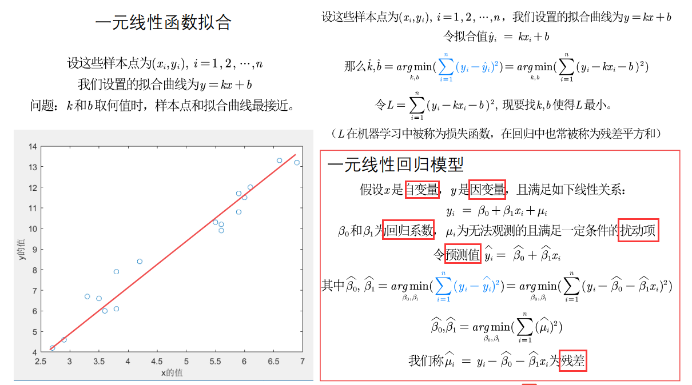

> 本质上和拟合差不多；$\mu$的一定条件下面会讲

对线性的理解：

- 允许一定的转换，比如下面这四个例子，都可以通过**变量代换**转换为线性模型

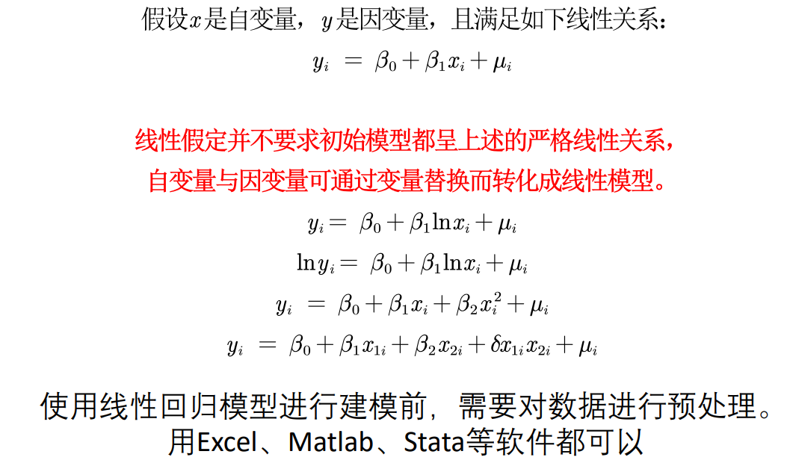

### 2.2 对回归系数的解释

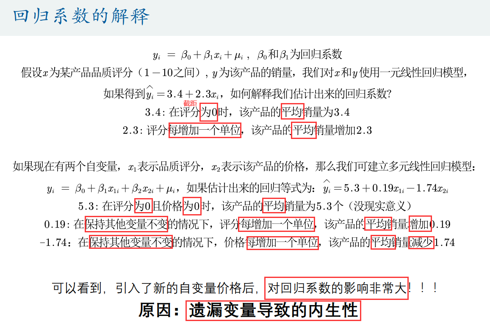

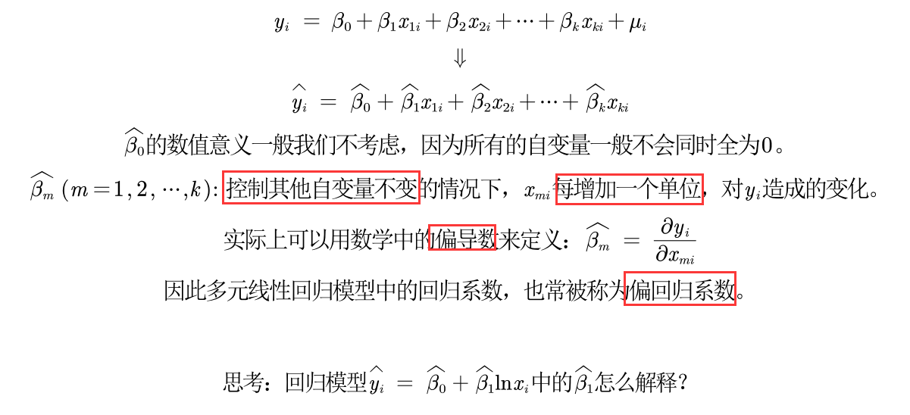

取对数的意义：

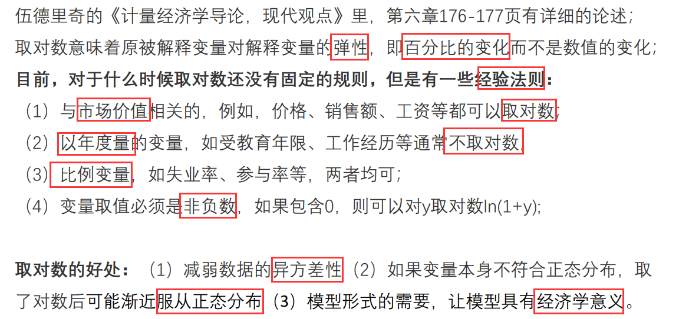

> 可以把“异方差”理解成$\mu$

### 2.3 四类模型回归系数的解释

一元线性回归：

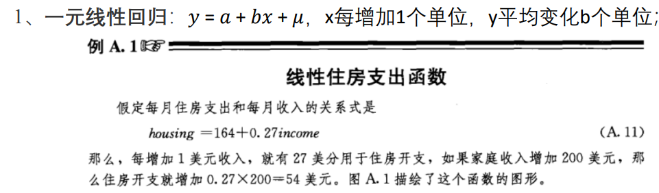

> 偏效应

双对数模型：

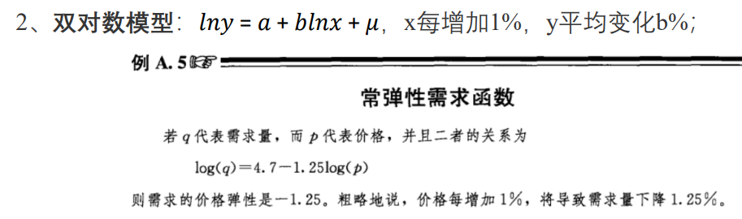

> 弹性

半对数模型：

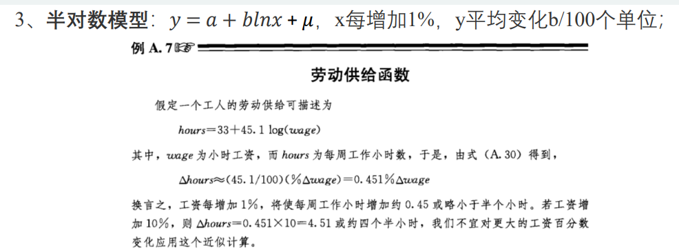

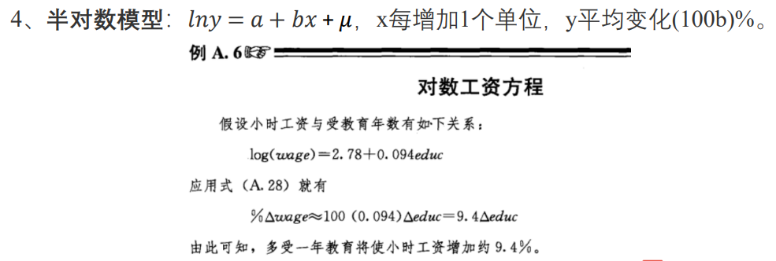

> 半弹性

## 3 内生性及其影响

### 3.1 内生性与外生性的概念

内生性与外生性：

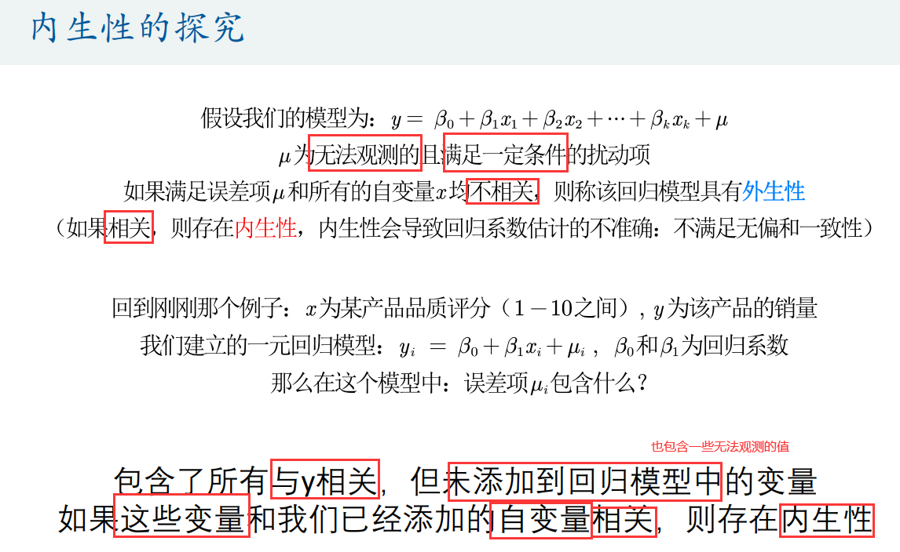

### 3.2 内生性的蒙特卡罗模拟

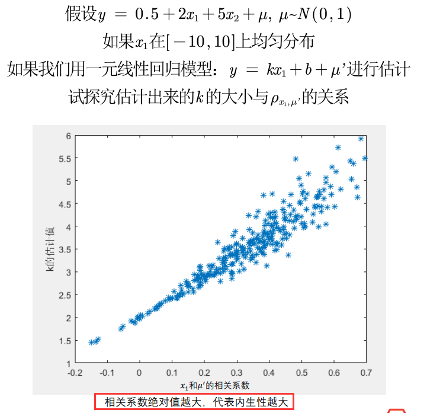

### 3.3 核心解释变量和控制变量

> 无内生性（no endogeneity）要求所有解释变量均与扰动项不相关。
>
> 这个假定通常太强，因为解释变量一般很多（比如，5‐15个解释变量）， 且需要保证它们全部外生。 
>
> 是否可能弱化此条件？答案是肯定的，如果你的解释变量可以区分为核心 解释变量与控制变量两类

核心解释变量：我们最感兴趣的变量，因此我们特别希望得到对其系数的**一致估计**（当样本容量无限增大时，收敛于待估计参数的真值 ）。 

控制变量：我们可能对于这些变量本身并无太大兴趣；而之所以把它们也**放入回归方程**，主要是为了 “控制住” 那些**对被解释变量有影响的遗漏因素**。

==在实际应用中，我们只要保证核心解释变量与𝝁不相关即可==

## 4 特殊的自变量：虚拟变量X

### 4.1 概念

如果自变量中有**定性变量**，例如性别、地域等，在回归中要怎么处理呢？

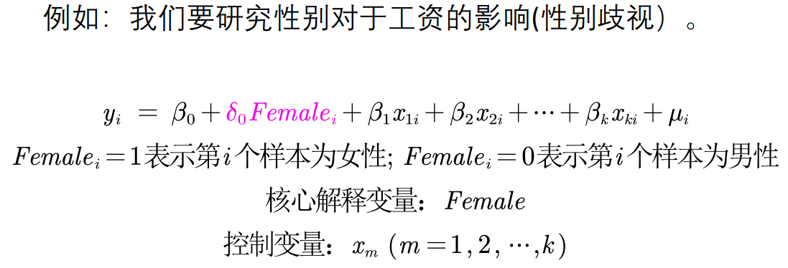

### 4.2 对虚拟变量的解释

对上例进行解释：

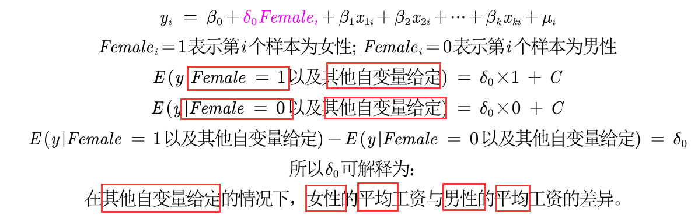

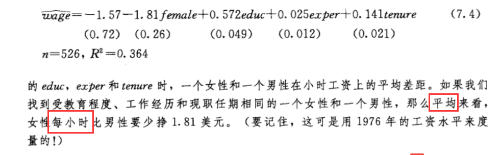

> 括号中的值之后会讲，用系数除以它就会得到一个检验值

### 4.3 多分类的虚拟变量设置

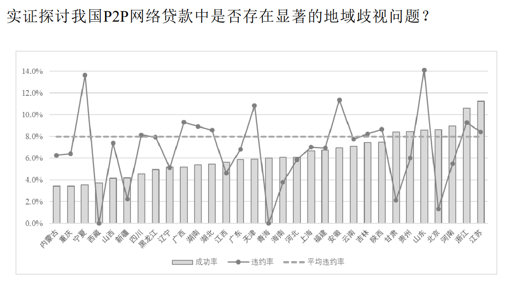

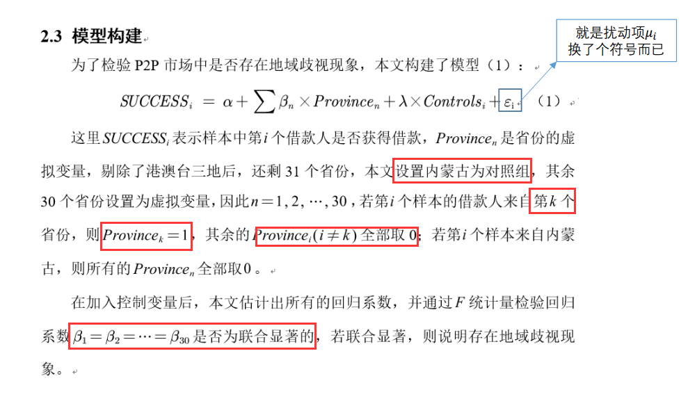

> 设置**对照组**，然后就可以转化为两两对比的问题；
>
> 为了避免**完全多重共线性**的影响，引入虚拟变量的个数一般是**分类数减1**。

## 5 含有交互项的自变量

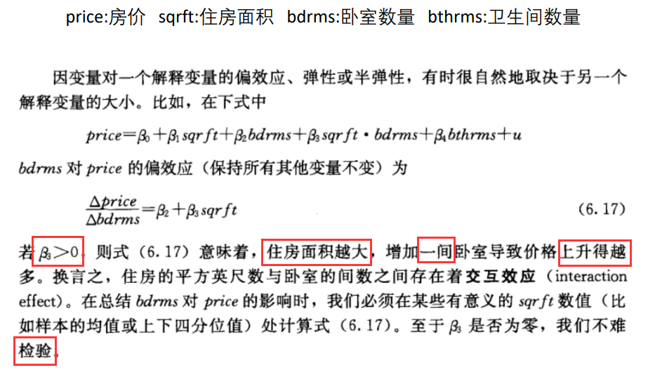

