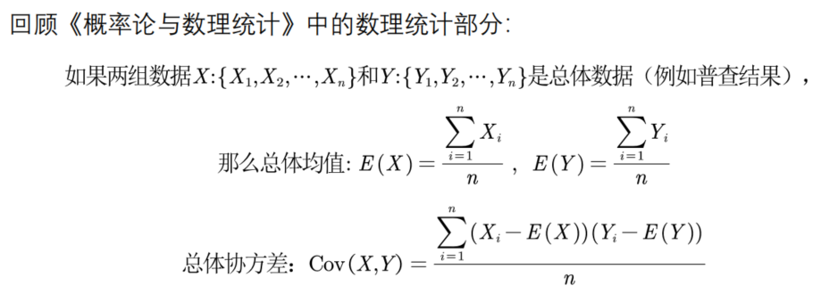
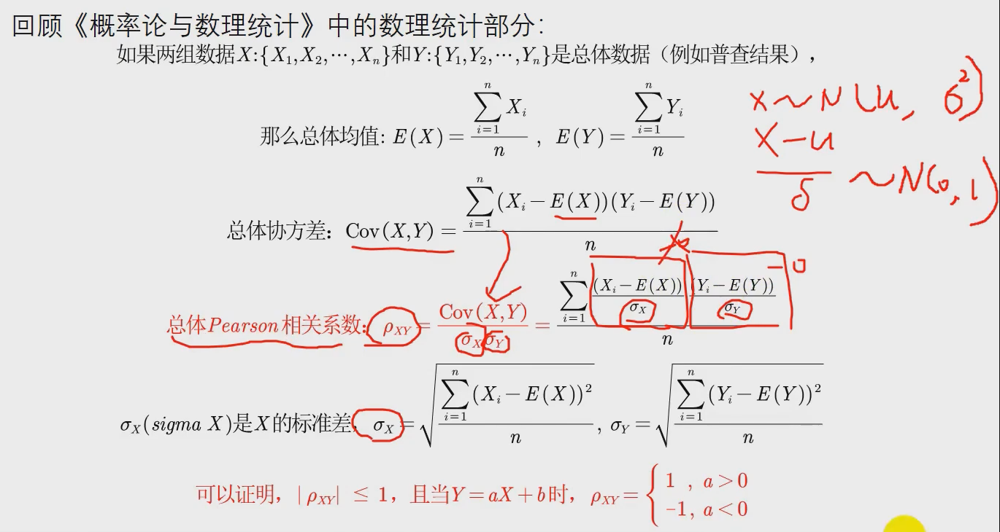
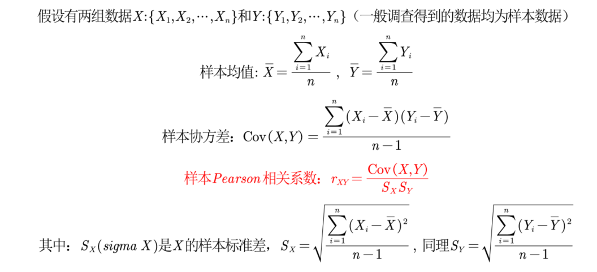
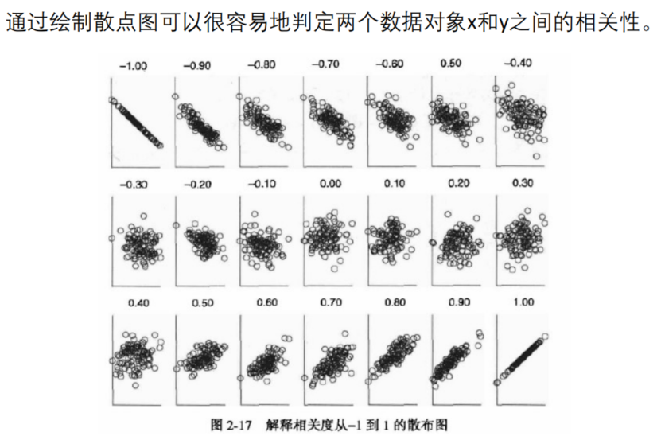
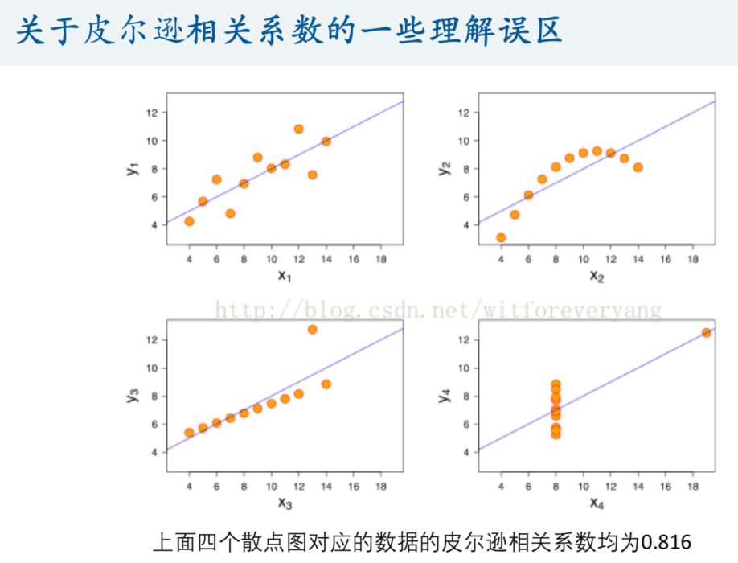
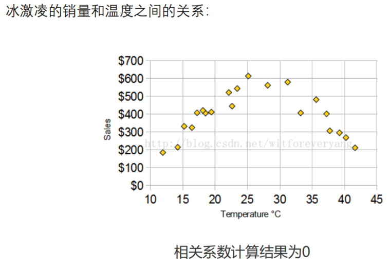
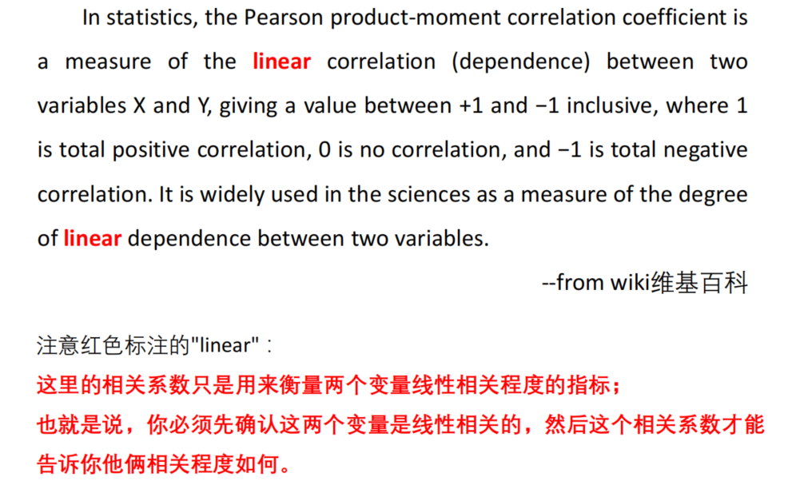
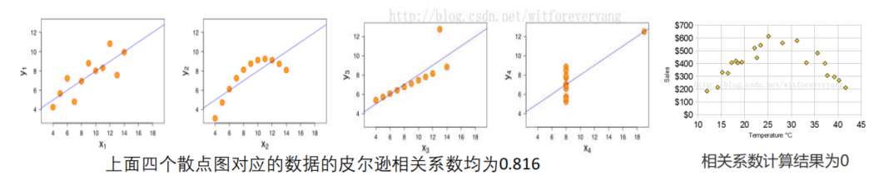
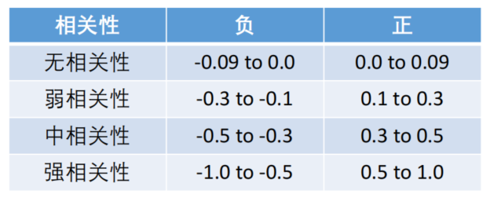
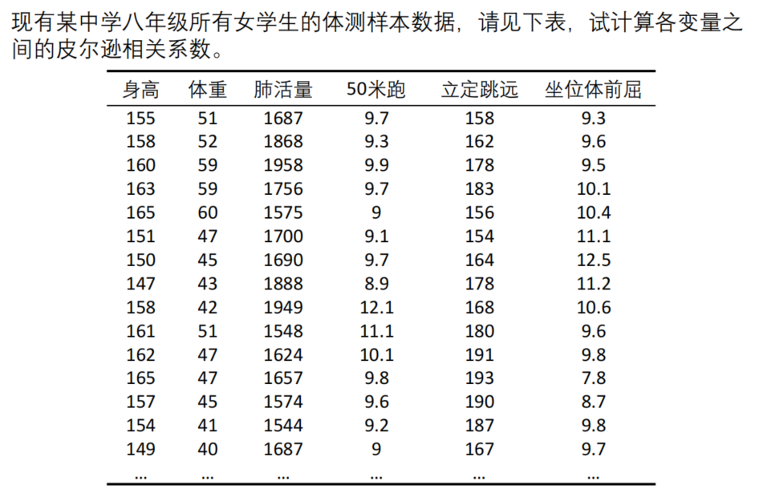

# Pearson相关系数

## 1 pearson相关系数的计算

### 1.1 总体Pearson相关系数

- **直观理解协方差：**如果X、Y变化方向相同，即当X大于（小于）其均值时，Y也大于（小于）其均值，在这两种情况下，乘积为正。如果X、Y的**变化方向一直保持相同**，则协方差为正；同理，如果X、Y**变化方向一直相反**，则协方差为负；如果X、Y变化方向之间相互无规律，即分子中有的项为正，有的项为负，那么累加后正负抵消。
- **注意：**协方差的大小和两个变量的**量纲**有关，因此**不适合做比较**。

- 皮尔逊相关系数也可以看成是剔除了两个变量量纲影响，即将X和Y标准化后的协方差。

### 1.2 样本Pearson相关系数

- 注意样本这里，标准差里面的**分母是n-1**

## 2 pearson相关系数的理解

### 2.1 相关性可视化

<u>pearson系数与散点图</u>：

<u>一些理解误区</u>：

- pearson相关系数受到异常值的影响较大

- pearson相关系数为0不代表没有关系

- 必须先确定线性相关的关系

  

<u>容易忽视和犯错的点</u>：

- **非线性相关也会导致线性相关系数很大**，例如图2。 
- **离群点对相关系数的影响很大**，例如图3，去掉离群点后，相关系数为0.98。 
- 如果两个变量的相关系数很大也不能说明两者相关，例如图4，可能是受到了异常值的影响。
- 相关系数计算结果为0，只能说**不是线性相关**，但说不定会有更复杂的相关关系（非线性相关），例如图5。

总结：

- 如果两个变量本身就是线性的关系，那么皮尔逊相关系数绝对值大的就是相关性强，小的就是相关性弱；

- 在**不确定两个变量**是什么关系的情况下，即使算出皮尔逊相关系数，发现很大，也不能说明那两个变量线性相关，甚至不能说他们相关，我们一定要**画出散点图**来看才行。

  > **画散点图很重要**

### 2.2 对相关系数大小的解释

- 上表所定的标准从某种意义上说是武断的和不严格的。对相关系数的解释是依赖于具体的应用背景和目的的。
- **事实上，比起相关系数的大小，我们往往更关注的是显著性。（假设检验）**

## 3 描述性统计

- 在写论文的时候，对数据的**描述性统计**很重要，就是在正式开始算法前，先说明数据的**基本特征**

  - 最值、均值、中位数
  - 偏度、峰度、标准差

  > 具体的python实现方式见xl.ipynb、numpy.ipynb

