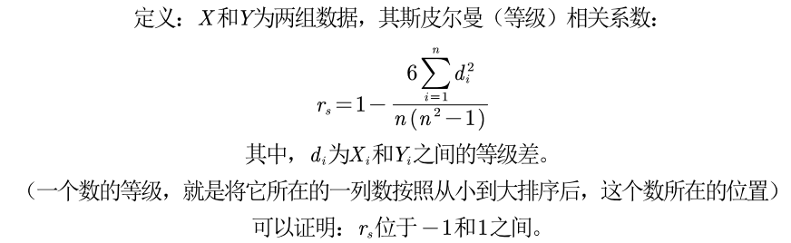
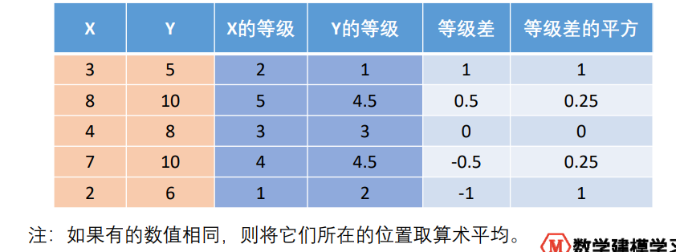
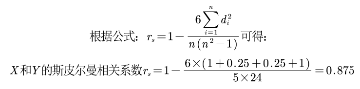
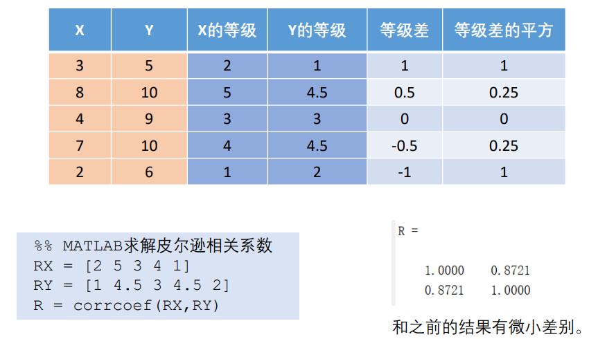
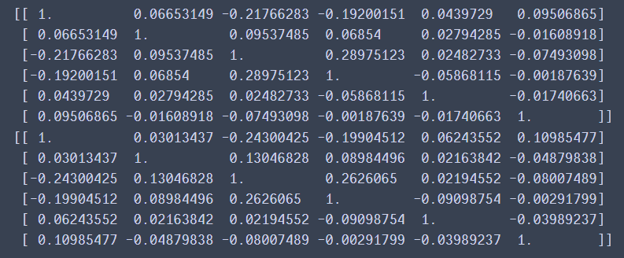

# spearman相关系数

## 1 数学原理

定义1：



> 
>
> 

定义2：


> 
>
> 这微小不同，是因为第一种计算时，位置相同会取算术平均

## 2 Python计算spearman相关系数

`pandas.DataFrame.corr(method='spearman')`

`scipy.stats.spearmanr(a, b, axis)`

```python
from scipy.stats import spearmanr
import numpy as np
X = np.array([3, 8, 4, 7, 2])
Y = np.array([5, 10, 9, 10, 6])
Z = np.array([
    [3, 8, 4, 7, 2],
    [5, 10, 9, 10, 6]
])
print(spearmanr(X, Y))
spearmanr(Z,axis=1)
```

对比：

```python
from scipy.stats import spearmanr
import pandas as pd
import numpy as np

dataframe = pd.read_excel('dataset/八年级女生体测数据.xlsx', sheet_name='Sheet1')
data = dataframe.values

print(np.corrcoef(data.T))
print(spearmanr(data).correlation)
```



> 对应位置**正负**相同

## 3 假设检验

见假设检验部分


