## 3 模糊综合评价法

### 3.1 概述

#### 3.1.1 数学归纳法和秃子悖论

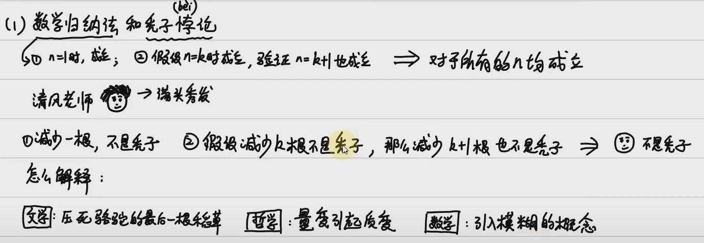

> 根据这个引子可知，数学中有必要引入**模糊**的概念

#### 3.3.2 数学中研究的量的划分

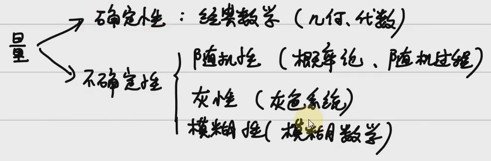

#### 3.3.3 生活中处处存在模糊性

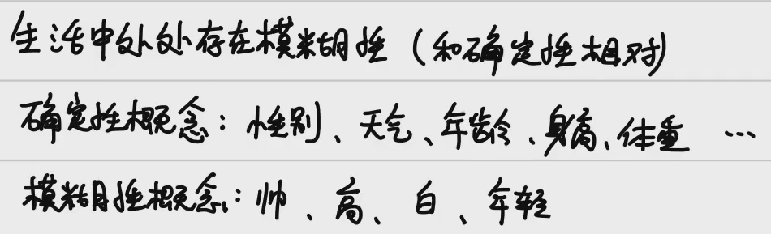

#### 3.3.4 模糊数学的介绍

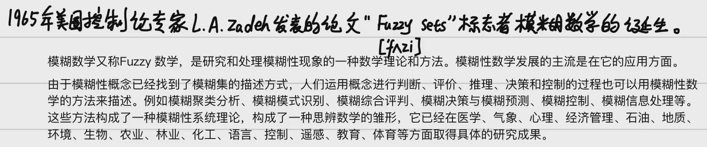

### 3.2 经典集合与模糊集合的基本概念

#### 3.2.1 经典集合和特征函数

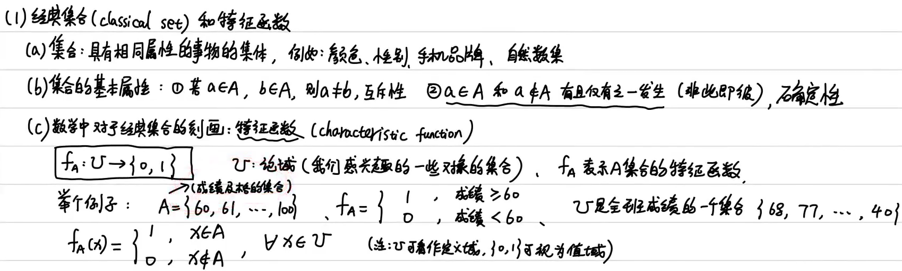

- **任意一个元素，要么在，要么不在**，特征函数就可以用来确定这一点，从而确定一个集合
  - 前提是有一个大的论域，可以看成定义域，在或不在就是值域

#### 3.2.2 模糊集合和隶属函数

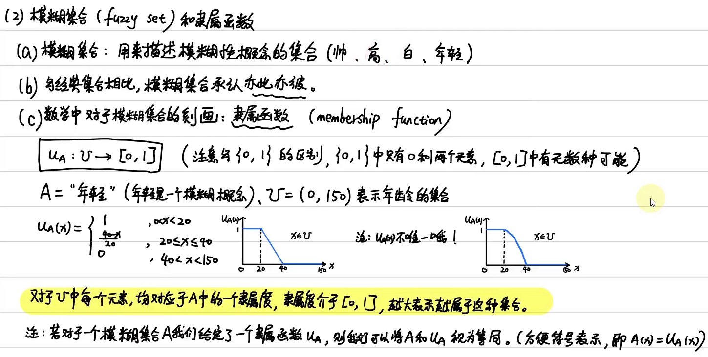

- 上图中的A就是一个模糊集合

- 模糊集合承认亦此亦彼，只是有个在不在的**概率**问题，就是**隶属度**

- 与经典集合的特征函数对比，**隶属函数的值域是$[0,1]$**

  > 隶属函数可变性很大，有道理即可

- ==对于U中每一个元素，均对应A中的一个隶属度，隶属度介于$[0,1]$，越大表示越属于这种集合==

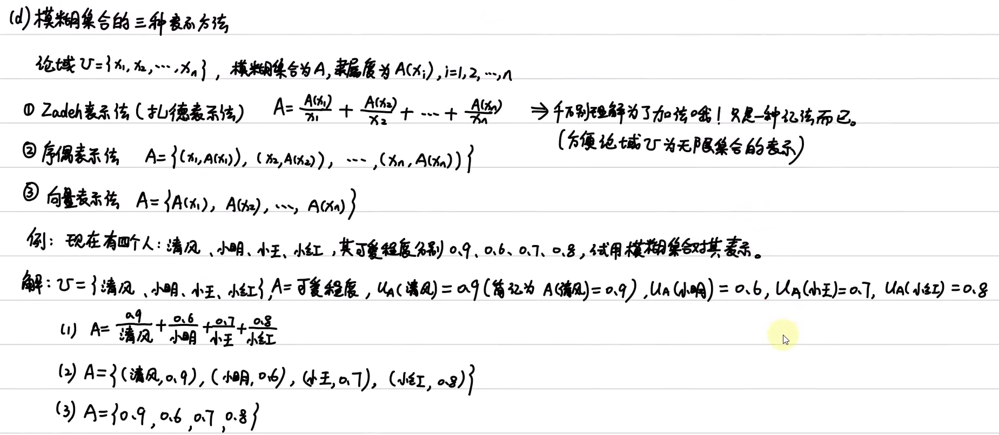

- 一个模糊集合要对论域中的所有元素都有一个隶属度，就像经典集合要对论域中所有元素都能确定在或不在

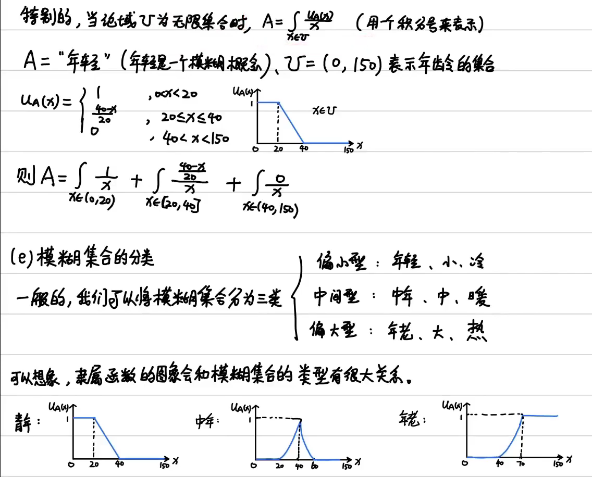

> 这里的三类和之前讲过的“正向化”有联系，定义这三种类型也是给后面的**综合评价**做铺垫

### 3.3 隶属函数的三种确定方法

> 一般来说在比赛中不会用模糊统计法，如果能找到资料有已有的客观尺度，就用第二种，如果不能，就用指派法

#### 3.3.1 模糊统计法

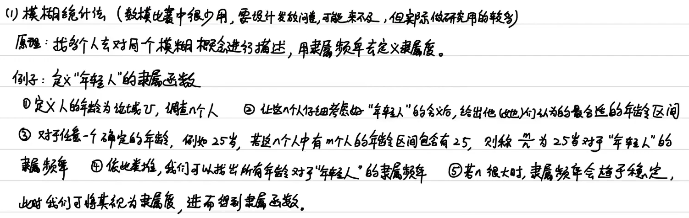

> 写科研论文可以用这种方法

- 隶属频率

#### 3.3.2 借助已有客观尺度

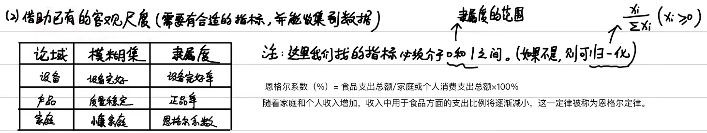

- 直接把已有的客观尺度当成**隶属函数**

#### 3.3.3 指派法 

> 根据问题的性质直接套用某些分布作为隶属函数，主观性较强

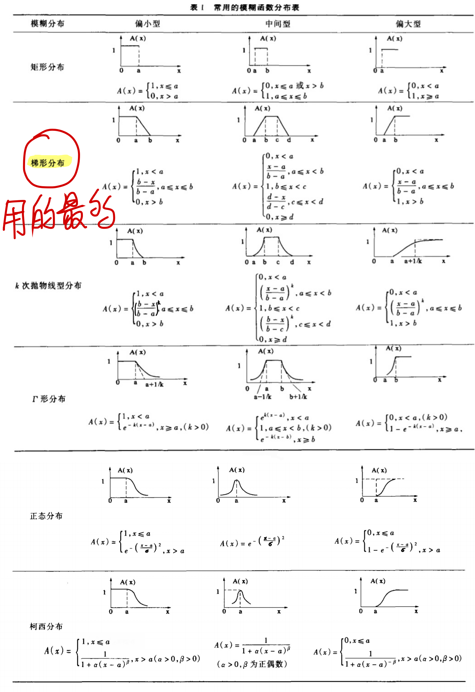

- 注意这里每种分布都有**三种类型**

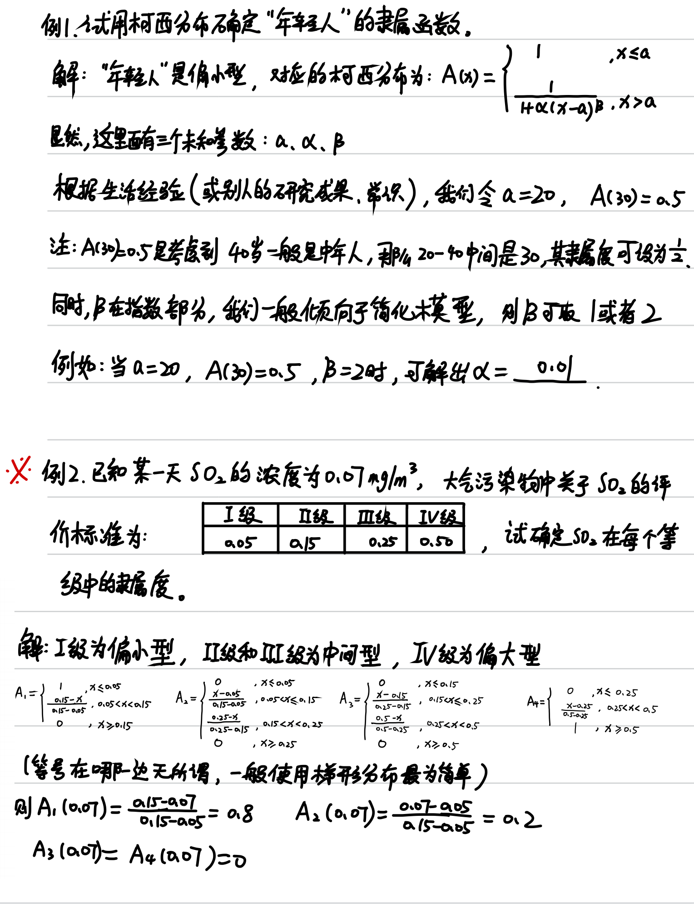

- 例1：
  - 确定三个未知参数的方法
    - 自变量分段点
    - 根据常识确定一个函数点
    - 为了简化模型
- :star:例2：
  - 使用**梯形分布**，首先要确定好类型，然后就是要确定a、b（、c、d），也就是找合适的**分段点**
  - 对于中间型来说，要注意什么时候让两边取0，可能会出现一个**尖峰**

### 3.4 应用：模糊综合评价

#### 3.4.1 评价问题概述

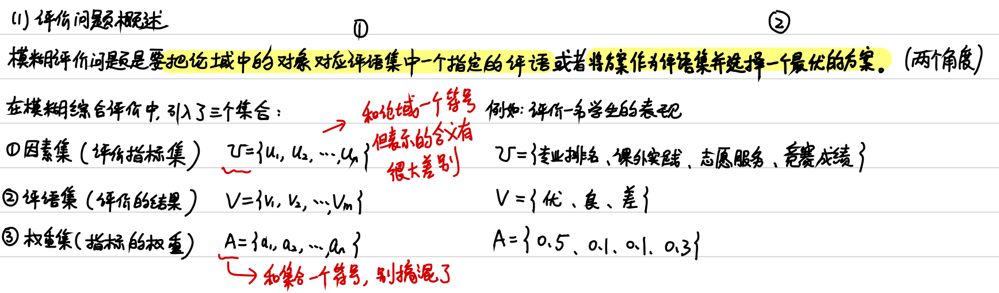

- 要解决的问题

  - 评语
  - 最优方案

- 重要的三个集合

  - 因素

  - 评语/方案

    > 用什么评语评价？$\rarr$哪个评语最合理$\rarr$哪个评语最能考虑到所有指标和权重$\rarr$哪个方案最能考虑到所有指标和权重$\rarr$选哪个**评价方案**最合理

  - 权重

#### 3.4.2 一级模糊综合评价模型

<u>基本思想介绍</u>：

- 如何选择一级、多级

- 一级模糊综合评价步骤

  1. 因素/指标集

     - 数量少，相减性不强（因为是一级，强的话就可以用多级了）

  2. 评语集

  3. 权重

     - Delphi/专家
     - 无数据：层次分析
     - 有数据：熵权

     > 权重要归一化，和为1

  4. :star:==确定**模糊综合判断矩阵**==

     - 每个要评价的对象都对应一个矩阵：这个人在各项指标方面的获得的评价

       > 在例题1中，其确定方式是**他人主观评价**；
       >
       > 在例题2中，其确定方式是**客观数据与指派**

       > 这里就有用到**隶属函数**，上面讲了很多的理论其实就这里用到了

     - 列：看每一个指标是否符合这一个评语，也就是让每一个指标对这个评语都有隶属度

     - 行：评价这一个指标怎么样，也就是对每一个评语的隶属度

       > 一行只评价了一个指标，不能叫”综合“，所以**综合评价**一般都是要有**多个指标**的

  5. 综合评判

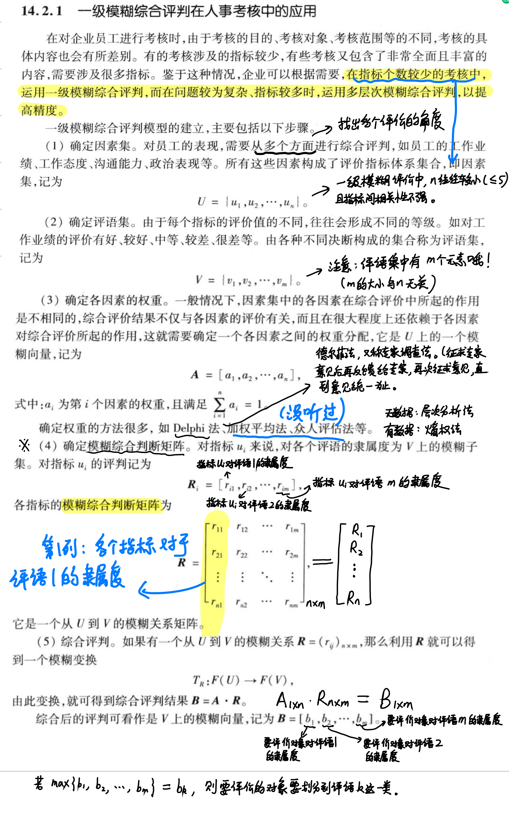

<u>例题1</u>：

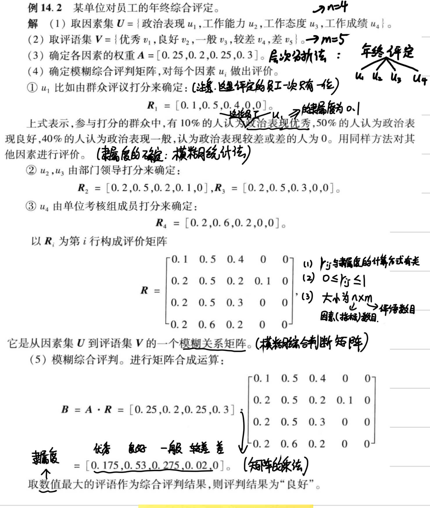

<u>例题2</u>：

- 因素：污染物
  - 各污染物较为独立，可以使用一级
- 评语：等级就可以当作评语
- 权重：题目已经给了
- 综合评判矩阵：根据**客观数据和指派**确定

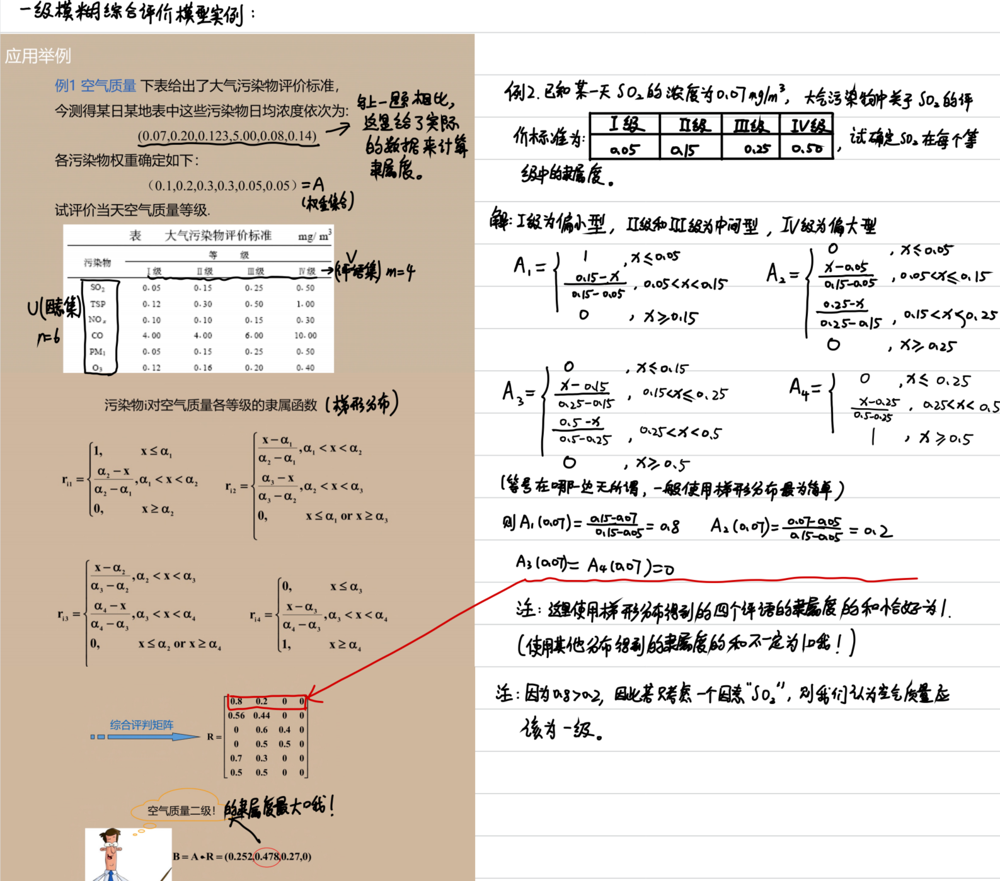

例题3：

- 因素：题目已经给了

- 这里就可以把”**评语**“替换成”**方案**“了

  > 这题也可以用TOPSIS

- 权重：有数据，可以使用**熵权法**，当然这题专家也给了

- 模糊综合判断矩阵：

  - 为了确定隶属函数，要先区分好偏大型和偏小型

  - 在确定隶属函数时，要保证”越大越属于“，所以这里也有**正向化**

  - 可采矿量、基建投资的隶属函数就借助了**已有客观尺度**来确定

    > 当然，主观上自己用了一个线性函数套用进去

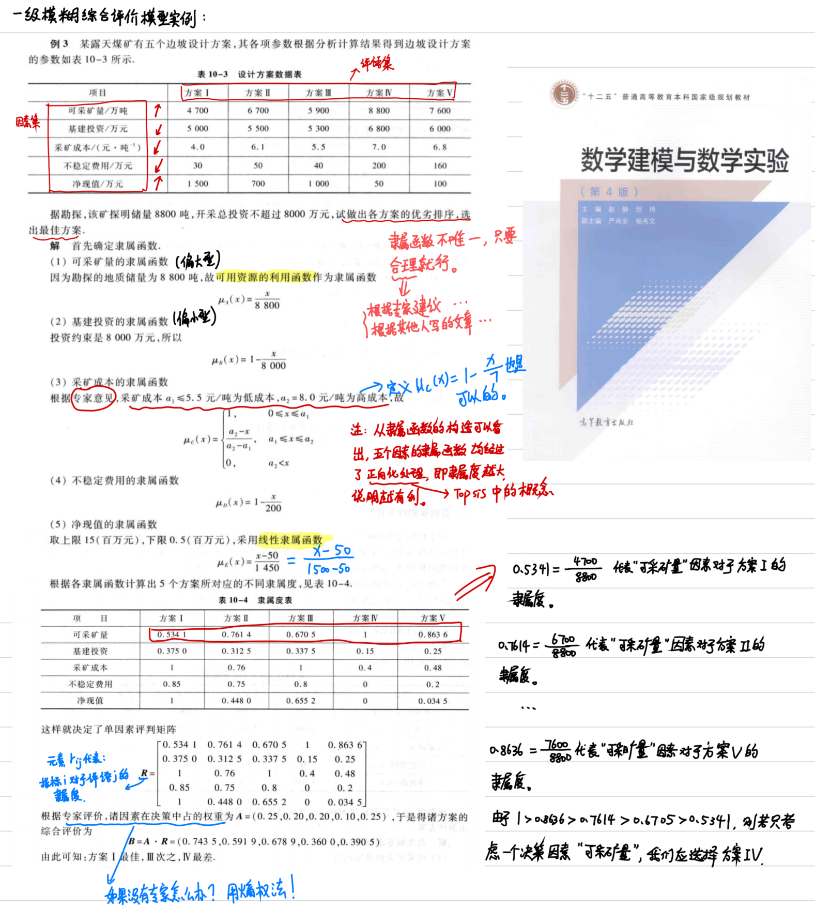

#### 3.4.3 多级模糊综合评价模型

<u>概述</u>：

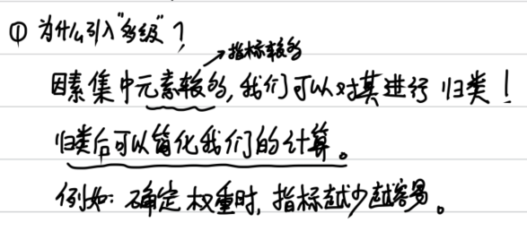

- 对因素/指标进行**分类**

<u>二级模糊评价模型</u>：

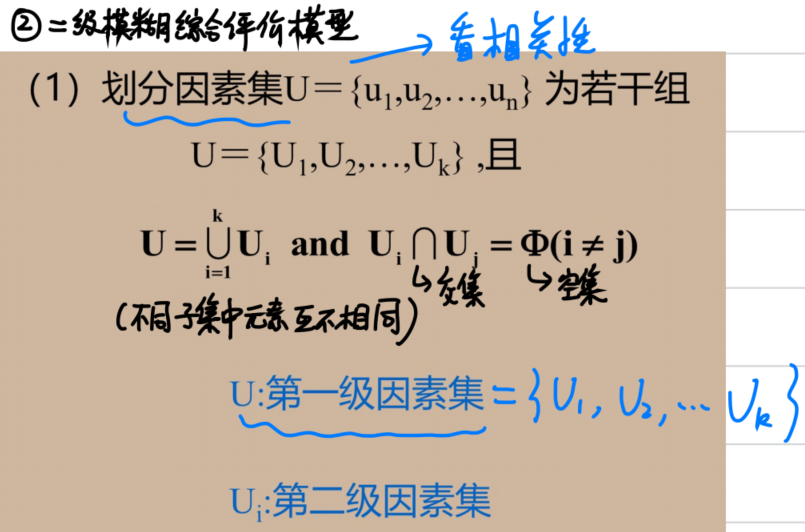

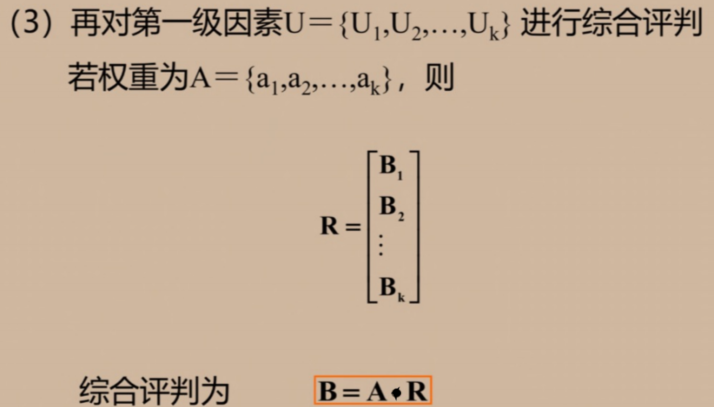

- 总之，重点都是**综合评判矩阵**怎么来，第一级的由第二级得来，第二级的可以直接根据隶属函数或已有的评价得来

<u>例题</u>：

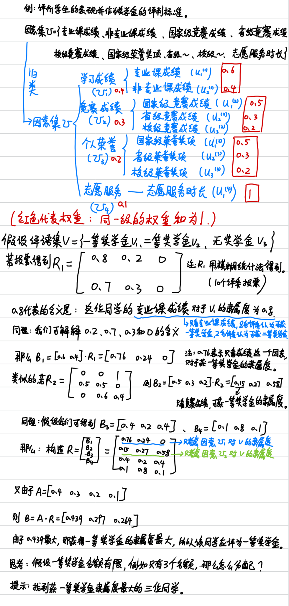

<u>三级模糊综合评价模型</u>：

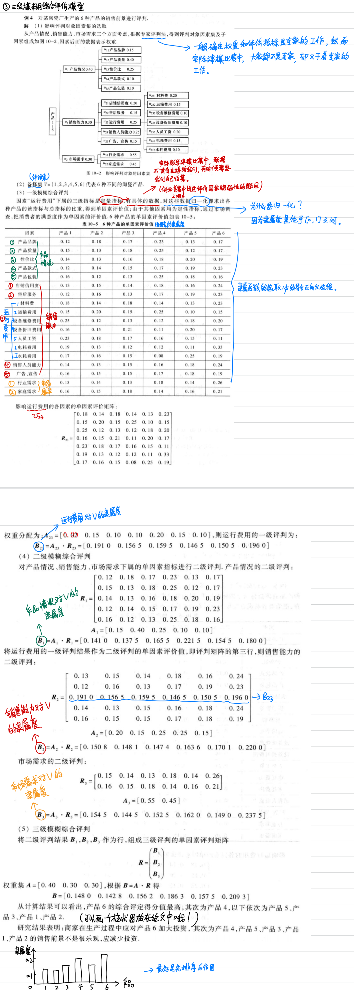

> 题目没有交待正向化，但是必须要**正向化**的